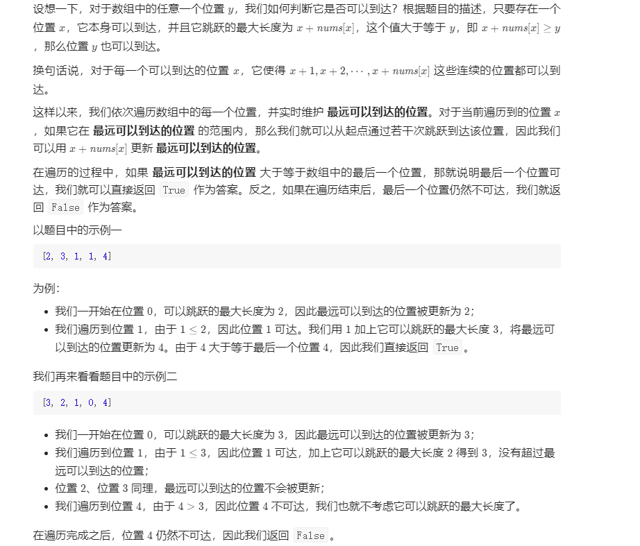

方法一：贪心
我们可以用贪心的方法解决这个问题。

设想一下，对于数组中的任意一个位置 yy，我们如何判断它是否可以到达？根据题目的描述，只要存在一个位置 xx，它本身可以到达，并且它跳跃的最大长度为 x + \textit{nums}[x]x+nums[x]，这个值大于等于 yy，即 x + \textit{nums}[x] \geq yx+nums[x]≥y，那么位置 yy 也可以到达。

换句话说，对于每一个可以到达的位置 xx，它使得 x+1, x+2, \cdots, x+\textit{nums}[x]x+1,x+2,⋯,x+nums[x] 这些连续的位置都可以到达。

这样以来，我们依次遍历数组中的每一个位置，并实时维护 最远可以到达的位置。对于当前遍历到的位置 xx，如果它在 最远可以到达的位置 的范围内，那么我们就可以从起点通过若干次跳跃到达该位置，因此我们可以用 x + \textit{nums}[x]x+nums[x] 更新 最远可以到达的位置。

在遍历的过程中，如果 最远可以到达的位置 大于等于数组中的最后一个位置，那就说明最后一个位置可达，我们就可以直接返回 True 作为答案。反之，如果在遍历结束后，最后一个位置仍然不可达，我们就返回 False 作为答案。

以题目中的示例一

[2, 3, 1, 1, 4]
为例：

我们一开始在位置 00，可以跳跃的最大长度为 22，因此最远可以到达的位置被更新为 22；

我们遍历到位置 11，由于 1 \leq 21≤2，因此位置 11 可达。我们用 11 加上它可以跳跃的最大长度 33，将最远可以到达的位置更新为 44。由于 44 大于等于最后一个位置 44，因此我们直接返回 True。

我们再来看看题目中的示例二

[3, 2, 1, 0, 4]
我们一开始在位置 00，可以跳跃的最大长度为 33，因此最远可以到达的位置被更新为 33；

我们遍历到位置 11，由于 1 \leq 31≤3，因此位置 11 可达，加上它可以跳跃的最大长度 22 得到 33，没有超过最远可以到达的位置；

位置 22、位置 33 同理，最远可以到达的位置不会被更新；

我们遍历到位置 44，由于 4 > 34>3，因此位置 44 不可达，我们也就不考虑它可以跳跃的最大长度了。

在遍历完成之后，位置 44 仍然不可达，因此我们返回 False。

JavaC++Python3

复杂度分析

时间复杂度：O(n)O(n)，其中 nn 为数组的大小。只需要访问 nums 数组一遍，共 nn 个位置。

空间复杂度：O(1)O(1)，不需要额外的空间开销。
