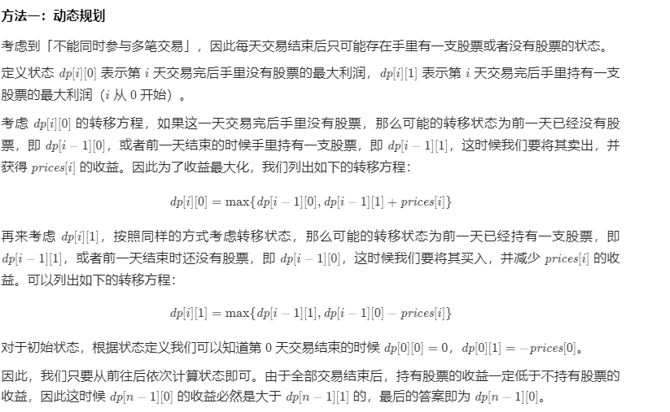
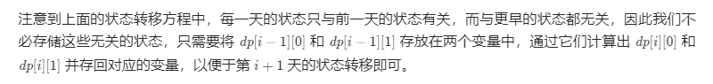
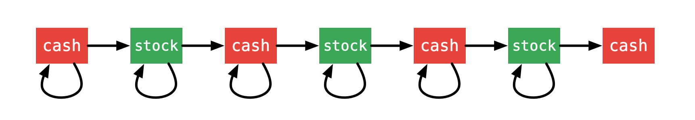

方法一：动态规划

复杂度分析

时间复杂度：O(n)，其中 n 为数组的长度。一共有 2n 个状态，每次状态转移的时间复杂度为 O(1)，因此时间复杂度为 O(2n)=O(n)。

空间复杂度：O(n)。我们需要开辟 O(n) 空间存储动态规划中的所有状态。如果使用空间优化，空间复杂度可以优化至 O(1)。

方法二：动态规划（通用）
根据 「力扣」第 121 题的思路，需要设置一个二维矩阵表示状态。

第 1 步：定义状态
状态 dp[i][j] 定义如下：

dp[i][j] 表示到下标为 i 的这一天，持股状态为 j 时，我们手上拥有的最大现金数。

注意：限定持股状态为 j 是为了方便推导状态转移方程，这样的做法满足 无后效性。

其中：

第一维 i 表示下标为 i 的那一天（ 具有前缀性质，即考虑了之前天数的交易 ）；
第二维 j 表示下标为 i 的那一天是持有股票，还是持有现金。这里 0 表示持有现金（cash），1 表示持有股票（stock）。
第 2 步：思考状态转移方程
状态从持有现金（cash）开始，到最后一天我们关心的状态依然是持有现金（cash）；
每一天状态可以转移，也可以不动。状态转移用下图表示：

（状态转移方程写在代码中）

说明：

由于不限制交易次数，除了最后一天，每一天的状态可能不变化，也可能转移；
写代码的时候，可以不用对最后一天单独处理，输出最后一天，状态为 0 的时候的值即可。
第 3 步：确定初始值
起始的时候：

如果什么都不做，dp[0][0] = 0；
如果持有股票，当前拥有的现金数是当天股价的相反数，即 dp[0][1] = -prices[i]；
第 4 步：确定输出值
终止的时候，上面也分析了，输出 dp[len - 1][0]，因为一定有 dp[len - 1][0] > dp[len - 1][1]。

参考代码 2：

Java

public class Solution {

    public int maxProfit(int[] prices) {
        int len = prices.length;
        if (len < 2) {
            return 0;
        }

        // 0：持有现金
        // 1：持有股票
        // 状态转移：0 → 1 → 0 → 1 → 0 → 1 → 0
        int[][] dp = new int[len][2];

        dp[0][0] = 0;
        dp[0][1] = -prices[0];

        for (int i = 1; i < len; i++) {
            // 这两行调换顺序也是可以的
            dp[i][0] = Math.max(dp[i - 1][0], dp[i - 1][1] + prices[i]);
            dp[i][1] = Math.max(dp[i - 1][1], dp[i - 1][0] - prices[i]);
        }
        return dp[len - 1][0];
    }
}
复杂度分析：

时间复杂度：O(N)O(N)，这里 NN 表示股价数组的长度；
空间复杂度：O(N)O(N)，虽然是二维数组，但是第二维是常数，与问题规模无关。
我们也可以将状态数组分开设置。

参考代码 3：

Java

public class Solution {

    public int maxProfit(int[] prices) {
        int len = prices.length;
        if (len < 2) {
            return 0;
        }

        // cash：持有现金
        // hold：持有股票
        // 状态数组
        // 状态转移：cash → hold → cash → hold → cash → hold → cash
        int[] cash = new int[len];
        int[] hold = new int[len];

        cash[0] = 0;
        hold[0] = -prices[0];

        for (int i = 1; i < len; i++) {
            // 这两行调换顺序也是可以的
            cash[i] = Math.max(cash[i - 1], hold[i - 1] + prices[i]);
            hold[i] = Math.max(hold[i - 1], cash[i - 1] - prices[i]);
        }
        return cash[len - 1];
    }
}
复杂度分析：（同上）

第 5 步：考虑优化空间
由于当前行只参考上一行，每一行就 2 个值，因此可以考虑使用「滚动变量」（「滚动数组」技巧）。

参考代码 4：

Java

public class Solution {

    public int maxProfit(int[] prices) {
        int len = prices.length;
        if (len < 2) {
            return 0;
        }

        // cash：持有现金
        // hold：持有股票
        // 状态转移：cash → hold → cash → hold → cash → hold → cash

        int cash = 0;
        int hold = -prices[0];

        int preCash = cash;
        int preHold = hold;
        for (int i = 1; i < len; i++) {
            cash = Math.max(preCash, preHold + prices[i]);
            hold = Math.max(preHold, preCash - prices[i]);

            preCash = cash;
            preHold = hold;
        }
        return cash;
    }
}
复杂度分析：

时间复杂度：O(N)O(N)，这里 NN 表示股价数组的长度；
空间复杂度：O(1)O(1)，分别使用两个滚动变量，将一维数组状态优化到常数大小。
