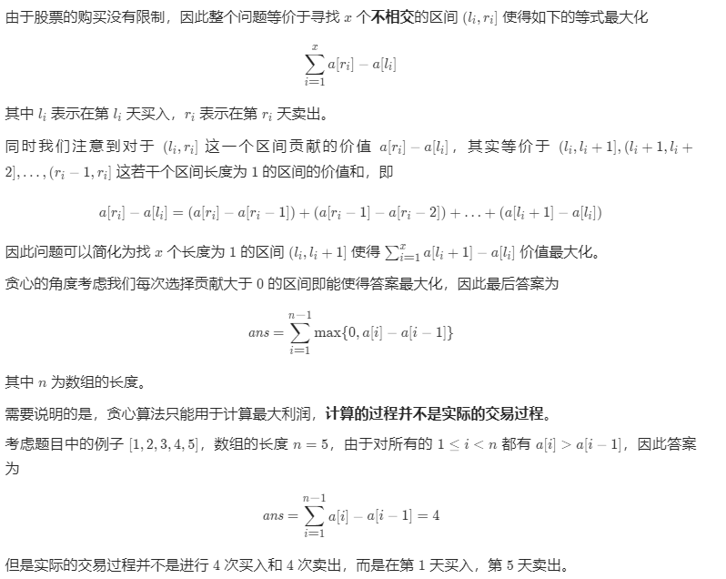

方法二：贪心

复杂度分析

时间复杂度：O(n)，其中 n 为数组的长度。我们只需要遍历一次数组即可。

空间复杂度：O(1)。只需要常数空间存放若干变量。
方法三：贪心算法（针对这道问题的特殊解法）
贪心算法的直觉：由于不限制交易次数，只要今天股价比昨天高，就交易。

下面对这个算法进行几点说明：

该算法仅可以用于计算，但 计算的过程并不是真正交易的过程，但可以用贪心算法计算题目要求的最大利润。下面说明等价性：以 [1, 2, 3, 4] 为例，这 4 天的股价依次上升，按照贪心算法，得到的最大利润是：
Java

res =  (prices[3] - prices[2]) + (prices[2] - prices[1]) + (prices[1] - prices[0])
=  prices[3] - prices[0]
仔细观察上面的式子，按照贪心算法，在下标为 1、2、3 的这三天，我们做的操作应该是买进昨天的，卖出今天的，虽然这种操作题目并不允许，但是它等价于：在下标为 0 的那一天买入，在下标为 3 的那一天卖出。

为什么叫「贪心算法」
回到贪心算法的定义：（下面是来自《算法导论（第三版）》第 16 章的叙述）

贪心算法 在每一步总是做出在当前看来最好的选择。

「贪心算法」 和 「动态规划」、「回溯搜索」 算法一样，完成一件事情，是 分步决策 的；
「贪心算法」 在每一步总是做出在当前看来最好的选择，我是这样理解 「最好」 这两个字的意思：
「最好」 的意思往往根据题目而来，可能是 「最小」，也可能是 「最大」；
贪心算法和动态规划相比，它既不看前面（也就是说它不需要从前面的状态转移过来），也不看后面（无后效性，后面的选择不会对前面的选择有影响），因此贪心算法时间复杂度一般是线性的，空间复杂度是常数级别的；
这道题 「贪心」 的地方在于，对于 「今天的股价 - 昨天的股价」，得到的结果有 3 种可能：① 正数，② 0，③负数。贪心算法的决策是： 只加正数 。
参考代码 5：

Java

public class Solution {

    public int maxProfit(int[] prices) {
        int len = prices.length;
        if (len < 2) {
            return 0;
        }

        int res = 0;
        for (int i = 1; i < len; i++) {
            int diff = prices[i] - prices[i - 1];
            if (diff > 0) {
                res += diff;
            }
        }
        return res;
    }
}
复杂度分析：

时间复杂度：O(N)，这里 N 表示股价数组的长度；
空间复杂度：O(1)。
等价写法：

参考代码 6：

Java

public class Solution {

    public int maxProfit(int[] prices) {
        int len = prices.length;
        if (len < 2) {
            return 0;
        }

        int res = 0;
        for (int i = 1; i < len; i++) {
            res += Math.max(prices[i] - prices[i - 1], 0);
        }
        return res;
    }
}
复杂度分析：（同上）

下面证明 「贪心算法」 的有效性。

贪心选择性质的证明：

借助 「差分」 这个概念，可以证明 「贪心算法」 的有效性。贪心算法是选择那些所有差分（严格）大于 0 的数，把它们相加即可。

使用反证法：

假设 「贪心算法」 得到的解并不是最优解，即我们还能够找到一个可行解比 「贪心算法」 得到的利润还多。差分数组中除了差分为正数的项以外，还有就是差分为 0 的项与差分为负数的项。
「贪心算法」 是所有差分为正数的项的和。有以下 3 种情况：

如果可行解在 「贪心算法」 的基础上，选择了差分为 0 的项，得到的结果与「贪心算法」得到的结果一样，因此加上差分为 0 的项不会比「贪心算法」得到的结果更好；
如果可行解在 「贪心算法」 的基础上，选择了差分为负数的项，加上一个负数得到的结果一定比 「贪心算法」 得到的结果要少，加上差分为负数的项，一定比 「贪心算法」 得到的结果更少；
如果可行解在 「贪心算法」 的基础上，去掉了任何一个差分为正数的项，同上，得到的结果一定比 「贪心算法」 得到的结果要小，因此，「贪心算法」 的所有组成项不能删去任何一个。
综上，除了 「贪心算法」 以外，找不到一个更优的解法，因此 「贪心算法」 就是最优解。（证完）
