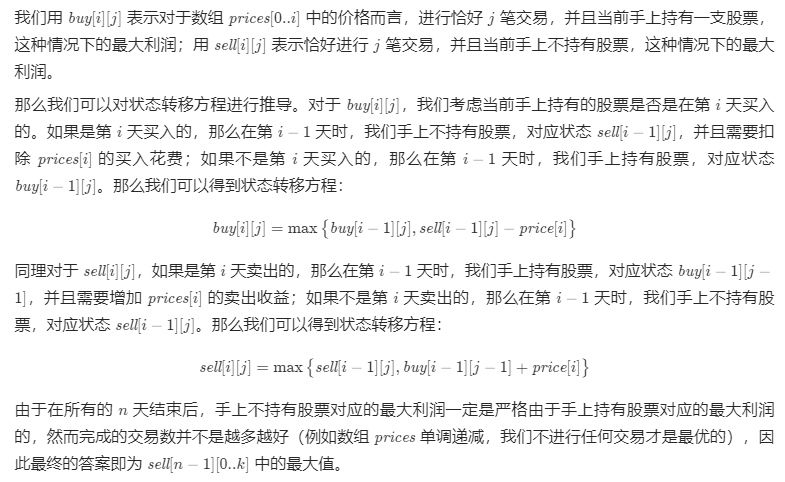
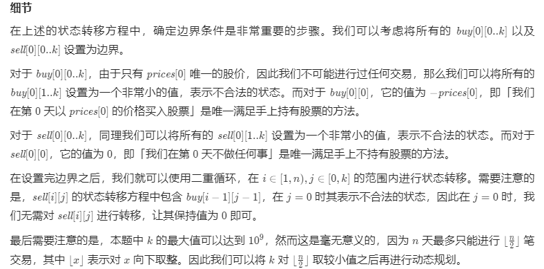
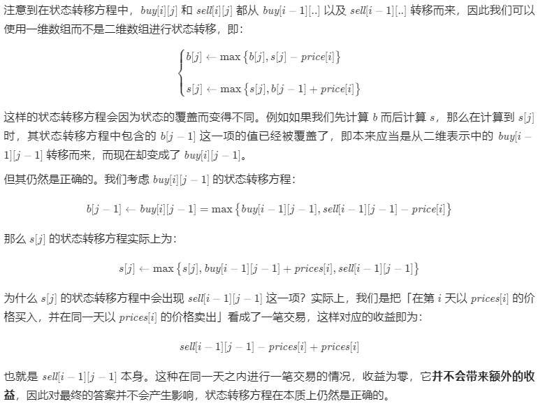

方法一：动态规划
思路与算法

与其余的股票问题类似，我们使用一系列变量存储「买入」的状态，再用一系列变量存储「卖出」的状态，通过动态规划的方法即可解决本题。

复杂度分析

时间复杂度：O(n min(n, k))，其中 n 是数组 prices 的大小，即我们使用二重循环进行动态规划需要的时间。

空间复杂度：O(n min(n, k)) 或 O(min(n,k))，取决于我们使用二维数组还是一维数组进行动态规划。

题目大意
给定一个数组 prices 代表一只股票，其中 prices[i] 代表这只股票第 i 天的价格。再给定一个整数 k，表示最多可完成 k 笔交易，且不能同时参与多笔交易（必须在再次购买前出售掉之前的股票）。

现在要求：计算所能获取的最大利润。

解题思路
动态规划求解。这道题是「0123. 买卖股票的最佳时机 III」的升级版，不过思路一样

最多可完成两笔交易意味着总共有三种情况：买卖一次，买卖两次，不买卖。

具体到每一天结束总共有 2 * k + 1 种状态：

未进行买卖状态；
第 1 次买入状态；
第 1 次卖出状态；
第 2 次买入状态；
第 2 次卖出状态。
...
第 m 次买入状态。
第 m 次卖出状态。
因为买入、卖出为两种状态，干脆我们直接让偶数序号表示买入状态，奇数序号表示卖出状态。

所以我们可以定义状态 dp[i][j] ，表示为：第 i 天第 j 种情况（0 <= j <= 2 * k）下，所获取的最大利润。

注意：这里第 j 种情况，并不一定是这一天一定要买入或卖出，而是这一天所处于的买入卖出状态。比如说前一天是第一次买入，第二天没有操作，则第二天就沿用前一天的第一次买入状态。

接下来确定状态转移公式：

第 0 种状态下显然利润为 0，可以直接赋值为昨天获取的最大利润，即 dp[i][0] = dp[i - 1][0]。
第 1 次买入状态下可以有两种状态推出，取最大的那一种赋值：
不做任何操作，直接沿用前一天买入状态所得的最大利润：dp[i][1] = dp[i - 1][1]。
第 1 次买入：dp[i][1] = dp[i - 1][0] - prices[i]。
第 1 次卖出状态下可以有两种状态推出，取最大的那一种赋值：
不做任何操作，直接沿用前一天卖出状态所得的最大利润：dp[i][2] = dp[i - 1][2]。
第 1 次卖出：dp[i][2] = dp[i - 1][1] + prices[i]。
第 2 次买入状态下可以有两种状态推出，取最大的那一种赋值：
不做任何操作，直接沿用前一天买入状态所得的最大利润：dp[i][3] = dp[i - 1][3]。
第 2 次买入：dp[i][3] = dp[i - 1][2] - prices[i]。
第 2 次卖出状态下可以有两种状态推出，取最大的那一种赋值：
不做任何操作，直接沿用前一天卖出状态所得的最大利润：dp[i][4] = dp[i - 1][4]。
第 2 次卖出：dp[i][4] = dp[i - 1][3] + prices[i]。
...
第 m 次（j = 2 * m）买入状态下可以有两种状态推出，取最大的那一种赋值：
不做任何操作，直接沿用前一天卖出状态所得的最大利润：dp[i][j] = dp[i - 1][j]。
第 m 次买入：dp[i][j] = dp[i - 1][j - 1] - prices[i]。
第 m 次（j = 2 * m + 1）卖出状态下可以有两种状态推出，取最大的那一种赋值：
不做任何操作，直接沿用前一天卖出状态所得的最大利润：dp[i][j] = dp[i - 1][j]。
第 m 次卖出：dp[i][j] = dp[i - 1][j - 1] + prices[i]。
下面确定初始化的边界值：

可以很明显看出第一天不做任何操作就是 dp[0][0] = 0，第 m 次买入（j = 2 * m）就是 dp[0][j] = -prices[i]。

第 m 次（j = 2 * m + 1）卖出的话，可以视作为没有盈利（当天买卖，价格没有变化），即 dp[0][j] = 0。

在递推结束后，最大利润肯定是无操作、第 m 次卖出这几种种情况里边，且为最大值。我们在维护的时候维护的是最大值，则第 m 次卖出所获得的利润肯定大于等于 0。而且，如果最优情况为 m - 1 笔交易，那么在转移状态时，我们允许在一天内进行多次交易，则 m - 1 笔交易的状态可以转移至 m 笔交易，最终都可以转移至 k 比交易。

所以最终答案为 dp[size - 1][2 * k]。size 为股票天数。
