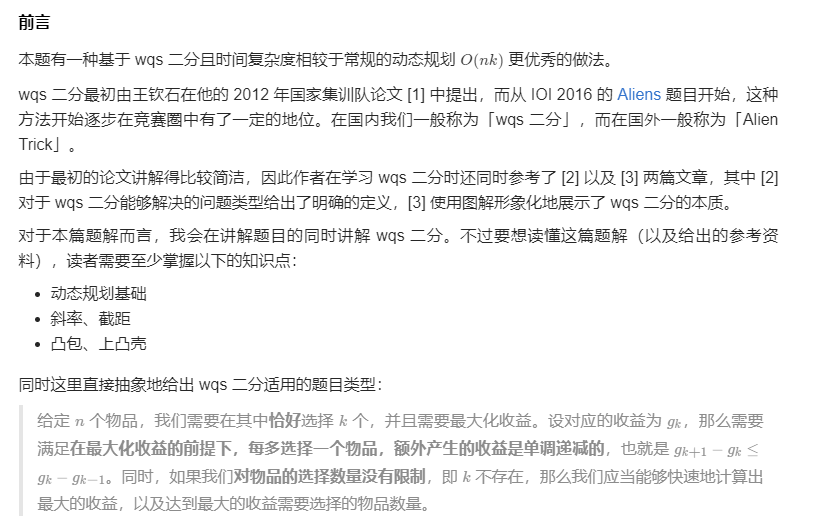

对于这种情况，我们可以在求解子问题时，尽可能地多进行交易，求解出最大的那个 k 值。从本质上来说，红色的点与绿色的点之间实际上只是相差了若干笔收益为 0 的交易而已，因此它们之间都是可以互相转换的。

class Solution {
public:
int maxProfit(int k, vector<int>& prices) {
if (prices.empty()) {
return 0;
}

        int n = prices.size();
        // 二分查找的上下界
        int left = 1, right = *max_element(prices.begin(), prices.end());
        // 存储答案，如果值为 -1 表示二分查找失败
        int ans = -1;
        while (left <= right) {
            // 二分得到当前的斜率（手续费）
            int c = (left + right) / 2;

            // 使用与 714 题相同的动态规划方法求解出最大收益以及对应的交易次数
            int buyCount = 0, sellCount = 0;
            int buy = -prices[0], sell = 0;

            for (int i = 1; i < n; ++i) {
                if (sell - prices[i] >= buy) {
                    buy = sell - prices[i];
                    buyCount = sellCount;
                }
                if (buy + prices[i] - c >= sell) {
                    sell = buy + prices[i] - c;
                    sellCount = buyCount + 1;
                }
            }

            // 如果交易次数大于等于 k，那么可以更新答案
            // 这里即使交易次数严格大于 k，更新答案也没有关系，因为总能二分到等于 k 的
            if (sellCount >= k) {
                // 别忘了加上 kc
                ans = sell + k * c;
                left = c + 1;
            }
            else {
                right = c - 1;
            }
        }

        // 如果二分查找失败，说明交易次数的限制不是瓶颈
        // 可以看作交易次数无限，直接使用贪心方法得到答案
        if (ans == -1) {
            ans = 0;
            for (int i = 1; i < n; ++i) {
                ans += max(prices[i] - prices[i - 1], 0);
            }
        }

        return ans;
    }
};
复杂度分析

时间复杂度：O(n \log C)O(nlogC)，其中 nn 是数组 \textit{prices}prices 的长度，CC 是数组 \textit{prices}prices 中的最大值，在本题中 C \leq 1000C≤1000。

空间复杂度：O(1)O(1)。

