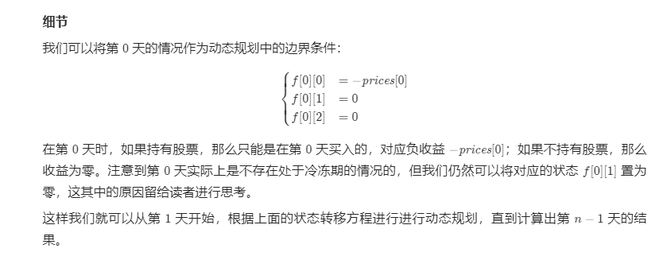

一种常用的方法是将「买入」和「卖出」分开进行考虑：「买入」为负收益，而「卖出」为正收益。在初入股市时，你只有「买入」的权利，只能获得负收益。
而当你「买入」之后，你就有了「卖出」的权利，可以获得正收益。显然，我们需要尽可能地降低负收益而提高正收益，因此我们的目标总是将收益值最大化。因此，
我们可以使用动态规划的方法，维护在股市中每一天结束后可以获得的「累计最大收益」，并以此进行状态转移，得到最终的答案。

方法一：动态规划
思路与算法

我们用 f[i] 表示第 i 天结束之后的「累计最大收益」。根据题目描述，由于我们最多只能同时买入（持有）一支股票，并且卖出股票后有冷冻期的限制，
因此我们会有三种不同的状态：

我们目前持有一支股票，对应的「累计最大收益」记为 f[i][0]；

我们目前不持有任何股票，并且处于冷冻期中，对应的「累计最大收益」记为 f[i][1]；

我们目前不持有任何股票，并且不处于冷冻期中，对应的「累计最大收益」记为 f[i][2]。

这里的「处于冷冻期」指的是在第 i 天结束之后的状态。也就是说：如果第 ii 天结束之后处于冷冻期，那么第 i+1 天无法买入股票。

如何进行状态转移呢？在第 i 天时，我们可以在不违反规则的前提下进行「买入」或者「卖出」操作，此时第 i 天的状态会从第 i-1 天的状态转移而来；
我们也可以不进行任何操作，此时第 i 天的状态就等同于第 i-1 天的状态。那么我们分别对这三种状态进行分析：

对对于 f[i][0]，我们目前持有的这一支股票可以是在第 i-1 天就已经持有的，对应的状态为 f[i-1][0]；或者是第 i 天买入的，那么第 i-1 天就不能持有股票并且不处于冷冻期中，
对应的状态为 f[i-1][2] 加上买入股票的负收益 prices[i]。因此状态转移方程为：

f[i][0]=max(f[i−1][0],f[i−1][2]−prices[i])

对于 f[i][1]f[i][1]，我们在第 ii 天结束之后处于冷冻期的原因是在当天卖出了股票，那么说明在第 i−1 天时我们必须持有一支股票，
对应的状态为 f[i-1][0] 加上卖出股票的正收益prices[i]。因此状态转移方程为：

f[i][1]=f[i−1][0]+prices[i]

对于 f[i][2]，我们在第 i 天结束之后不持有任何股票并且不处于冷冻期，说明当天没有进行任何操作，即第 i−1 天时不持有任何股票：如果处于冷冻期，
对应的状态为 f[i−1][1]；如果不处于冷冻期，对应的状态为 f[i−1][2]。因此状态转移方程为：

f[i][2]=max(f[i−1][1],f[i−1][2])

这样我们就得到了所有的状态转移方程。如果一共有 nn 天，那么最终的答案即为：

max(f[n−1][0],f[n−1][1],f[n−1][2])

注意到如果在最后一天（第 n-1 天）结束之后，手上仍然持有股票，那么显然是没有任何意义的。因此更加精确地，最终的答案实际上是 f[n-1][1] 和 f[n-1][2] 中的较大值，即：

max(f[n−1][1],f[n−1][2])

class Solution {
public int maxProfit(int[] prices) {
if (prices.length == 0) {
return 0;
}

        int n = prices.length;
        // f[i][0]: 手上持有股票的最大收益
        // f[i][1]: 手上不持有股票，并且处于冷冻期中的累计最大收益
        // f[i][2]: 手上不持有股票，并且不在冷冻期中的累计最大收益
        int[][] f = new int[n][3];
        f[0][0] = -prices[0];
        for (int i = 1; i < n; ++i) {
            f[i][0] = Math.max(f[i - 1][0], f[i - 1][2] - prices[i]);
            f[i][1] = f[i - 1][0] + prices[i];
            f[i][2] = Math.max(f[i - 1][1], f[i - 1][2]);
        }
        return Math.max(f[n - 1][1], f[n - 1][2]);
    }
}
空间优化

注意到上面的状态转移方程中，f[i][..]只与 f[i-1][..] 有关，而与 f[i-2][..] 及之前的所有状态都无关，因此我们不必存储这些无关的状态。也就是说，
我们只需要将 f[i-1][0]，f[i-1][1]，f[i-1][2] 存放在三个变量中，通过它们计算出 f[i][0]，f[i][1]，f[i][2] 并存回对应的变量，
以便于第 i+1 天的状态转移即可。

复杂度分析

时间复杂度：O(n)，其中 n 为数组 prices 的长度。

空间复杂度：O(n)。我们需要 3n 的空间存储动态规划中的所有状态，对应的空间复杂度为 O(n)。如果使用空间优化，空间复杂度可以优化至 O(1)。
