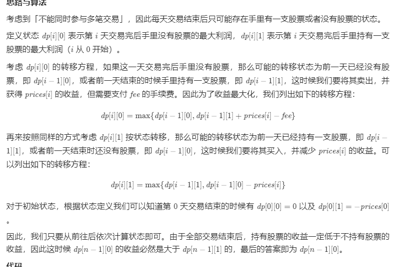
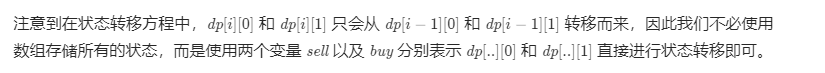

方法一：动态规划

class Solution {
public int maxProfit(int[] prices, int fee) {
int n = prices.length;
int[][] dp = new int[n][2];
dp[0][0] = 0;
dp[0][1] = -prices[0];
for (int i = 1; i < n; ++i) {
dp[i][0] = Math.max(dp[i - 1][0], dp[i - 1][1] + prices[i] - fee);
dp[i][1] = Math.max(dp[i - 1][1], dp[i - 1][0] - prices[i]);
}
return dp[n - 1][0];
}
}

作者：LeetCode-Solution
链接：https://leetcode-cn.com/problems/best-time-to-buy-and-sell-stock-with-transaction-fee/solution/mai-mai-gu-piao-de-zui-jia-shi-ji-han-sh-rzlz/
来源：力扣（LeetCode）
著作权归作者所有。商业转载请联系作者获得授权，非商业转载请注明出处。

class Solution {
public int maxProfit(int[] prices, int fee) {
int n = prices.length;
int sell = 0, buy = -prices[0];
for (int i = 1; i < n; ++i) {
sell = Math.max(sell, buy + prices[i] - fee);
buy = Math.max(buy, sell - prices[i]);
}
return sell;
}
}

空间优化：转移的时候，dp[i]dp[i] 只会从 dp[i-1]dp[i−1] 转移得来，因此第一维可以去掉：

Java

class Solution {
public int maxProfit(int[] prices, int fee) {
int n = prices.length;
int[] dp = new int[2];
dp[0] = 0;
dp[1] = -prices[0];
for (int i = 1; i < n; i++) {
int tmp = dp[0];
dp[0] = Math.max(dp[0], dp[1] + prices[i] - fee);
dp[1] = Math.max(dp[1], tmp - prices[i]);
}
return dp[0];
}
}

复杂度分析

时间复杂度：O(n)O(n)，其中 nn 为数组的长度。一共有 2n2n 个状态，每次状态转移的时间复杂度为 O(1)O(1)，因此时间复杂度为 O(2n)=O(n)O(2n)=O(n)。

空间复杂度：O(n)O(n) 或 O(1)O(1)，取决于是否使用数组存储所有的状态。
