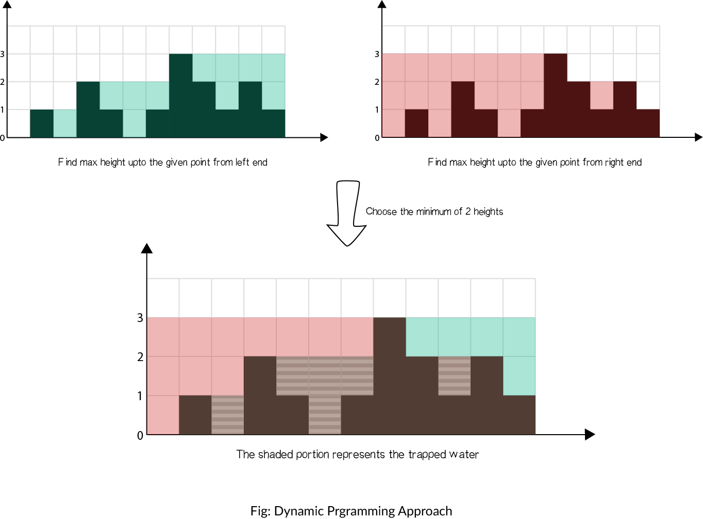

方法 2：动态编程

在暴力方法中，我们仅仅为了找到最大值每次都要向左和向右扫描一次。但是我们可以提前存储这个值。因此，可以通过动态编程解决。

这个概念可以见下图解释：

算法

找到数组中从下标 i 到最左端最高的条形块高度 left_max。
找到数组中从下标 i 到最右端最高的条形块高度 right_max。
扫描数组 height 并更新答案：
累加 min({max_left}[i],{max_right}[i]) - {height}[i] 到 ans 上

复杂性分析

时间复杂度：O(n)。

存储最大高度数组，需要两次遍历，每次 O(n) 。
最终使用存储的数据更新ans ，O(n)。
空间复杂度：O(n) 额外空间。

和方法 1 相比使用了额外的 O(n) 空间用来放置left_max 和 right_max 数组。

