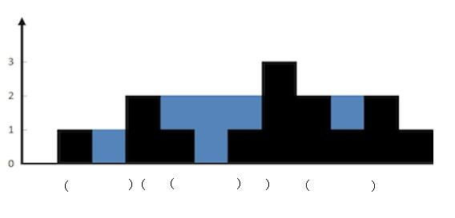
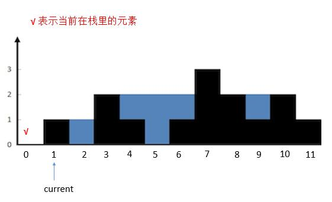
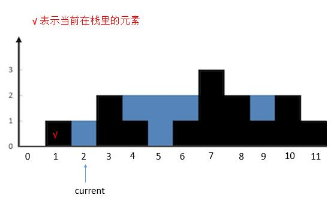
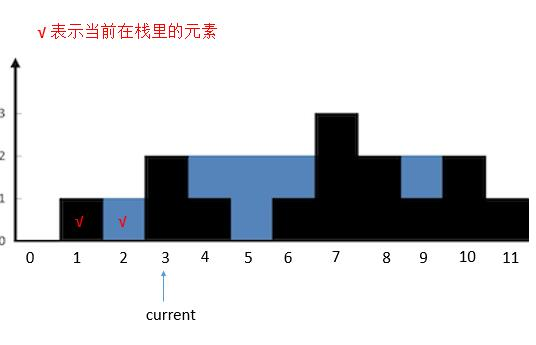
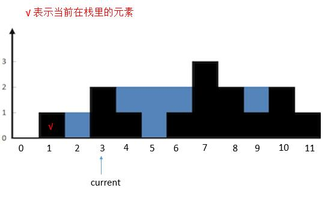
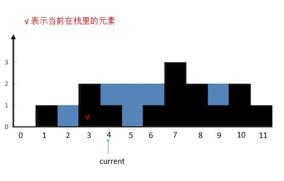
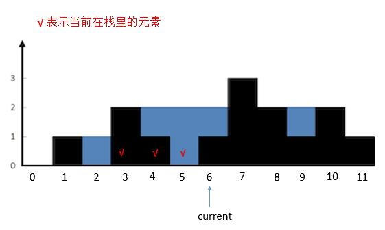
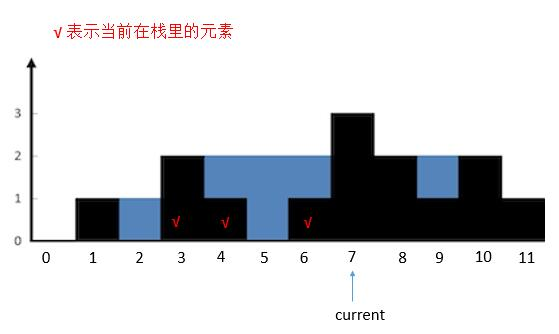

解法五：栈

说到栈，我们肯定会想到括号匹配了。我们仔细观察蓝色的部分，可以和括号匹配类比下。每次匹配出一对括号（找到对应的一堵墙），就计算这两堵墙中的水。

我们用栈保存每堵墙。

当遍历墙的高度的时候，如果当前高度小于栈顶的墙高度，说明这里会有积水，我们将墙的高度的下标入栈。

如果当前高度大于栈顶的墙的高度，说明之前的积水到这里停下，我们可以计算下有多少积水了。计算完，就把当前的墙继续入栈，作为新的积水的墙。

总体的原则就是，

当前高度小于等于栈顶高度，入栈，指针后移。

当前高度大于栈顶高度，出栈，计算出当前墙和栈顶的墙之间水的多少，然后计算当前的高度和新栈的高度的关系，重复第 2 步。直到当前墙的高度不大于栈顶高度或者栈空，然后把当前墙入栈，指针后移。

我们看具体的例子。

首先将 height [ 0 ] 入栈。然后 current 指向的高度大于栈顶高度，所以把栈顶 height [ 0 ] 出栈，然后栈空了，再把 height [ 1 ] 入栈。current 后移。

然后 current 指向的高度小于栈顶高度，height [ 2 ] 入栈，current 后移。

然后 current 指向的高度大于栈顶高度，栈顶 height [ 2 ] 出栈。计算 height [ 3 ] 和新的栈顶之间的水。计算完之后继续判断 current 和新的栈顶的关系。

current 指向的高度大于栈顶高度，栈顶 height [ 1 ] 出栈，栈空。所以把 height [ 3 ] 入栈。currtent 后移。

然后 current 指向的高度小于栈顶 height [ 3 ] 的高度，height [ 4 ] 入栈。current 后移。

然后 current 指向的高度小于栈顶 height [ 4 ] 的高度，height [ 5 ] 入栈。current 后移。

然后 current 指向的高度大于栈顶 height [ 5 ] 的高度，将栈顶 height [ 5 ] 出栈，然后计算 current 指向的墙和新栈顶 height [ 4 ] 之间的水。计算完之后继续判断 current 的指向和新栈顶的关系。此时 height [ 6 ] 不大于栈顶 height [ 4 ] ，所以将 height [ 6 ] 入栈。current 后移。

然后 current 指向的高度大于栈顶高度，将栈顶 height [ 6 ] 出栈。计算和新的栈顶 height [ 4 ] 组成两个边界中的水。然后判断 current 和新的栈顶 height [ 4 ] 的关系，依旧是大于，所以把 height [ 4 ] 出栈。计算 current 和 新的栈顶 height [ 3 ] 之间的水。然后判断 current 和新的栈顶 height [ 3 ] 的关系，依旧是大于，所以把 height [ 3 ] 出栈，栈空。将 current 指向的 height [ 7 ] 入栈。current 后移。

其实不停的出栈，可以看做是在找与 7 匹配的墙，也就是 3 。

而对于计算 current 指向墙和新的栈顶之间的水，根据图的关系，我们可以直接把这两个墙当做之前解法三的 max_left 和 max_right，然后之前弹出的栈顶当做每次遍历的 height [ i ]。水量就是 Min ( max _ left ，max _ right ) - height [ i ]，只不过这里需要乘上两个墙之间的距离。可以看下代码继续理解下。

Java

public int trap6(int[] height) {
int sum = 0;
Stack<Integer> stack = new Stack<>();
int current = 0;
while (current < height.length) {
//如果栈不空并且当前指向的高度大于栈顶高度就一直循环
while (!stack.empty() && height[current] > height[stack.peek()]) {
int h = height[stack.peek()]; //取出要出栈的元素
stack.pop(); //出栈
if (stack.empty()) { // 栈空就出去
break;
}
int distance = current - stack.peek() - 1; //两堵墙之前的距离。
int min = Math.min(height[stack.peek()], height[current]);
sum = sum + distance * (min - h);
}
stack.push(current); //当前指向的墙入栈
current++; //指针后移
}
return sum;
}
时间复杂度：虽然 while 循环里套了一个 while 循环，但是考虑到每个元素最多访问两次，入栈一次和出栈一次，所以时间复杂度是 O(n)。

空间复杂度：O(n)。栈的空间。
