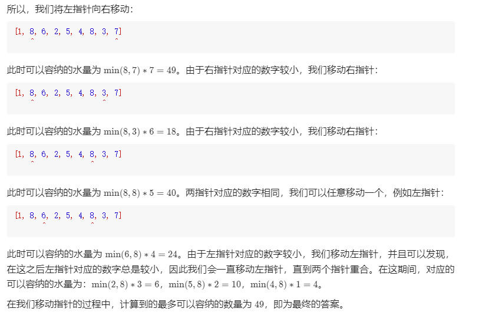
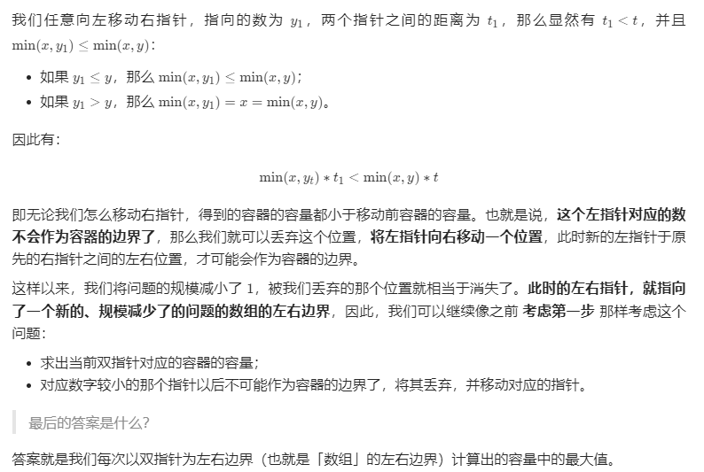

方法一：双指针
说明

本题是一道经典的面试题，最优的做法是使用「双指针」。如果读者第一次看到这题，不一定能想出双指针的做法。

分析

我们先从题目中的示例开始，一步一步地解释双指针算法的过程。稍后再给出算法正确性的证明。

题目中的示例为：

[1, 8, 6, 2, 5, 4, 8, 3, 7]
^                       ^
在初始时，左右指针分别指向数组的左右两端，它们可以容纳的水量为 min(1,7)∗8=8。

此时我们需要移动一个指针。移动哪一个呢？直觉告诉我们，应该移动对应数字较小的那个指针（即此时的左指针）。这是因为，由于容纳的水量是由

两个指针指向的数字中较小值 * 指针之间的距离
两个指针指向的数字中较小值∗指针之间的距离

决定的。如果我们移动数字较大的那个指针，那么前者「两个指针指向的数字中较小值」不会增加，后者「指针之间的距离」会减小，那么这个乘积会减小。因此，我们移动数字较大的那个指针是不合理的。因此，我们移动 数字较小的那个指针。

有读者可能会产生疑问：我们可不可以同时移动两个指针？ 先别急，我们先假设 总是移动数字较小的那个指针 的思路是正确的，在走完流程之后，我们再去进行证明。

证明

为什么双指针的做法是正确的？

双指针代表了什么？

双指针代表的是 可以作为容器边界的所有位置的范围。在一开始，双指针指向数组的左右边界，表示 数组中所有的位置都可以作为容器的边界，因为我们还没有进行过任何尝试。在这之后，我们每次将 对应的数字较小的那个指针 往 另一个指针 的方向移动一个位置，就表示我们认为 这个指针不可能再作为容器的边界了。

为什么对应的数字较小的那个指针不可能再作为容器的边界了？

在上面的分析部分，我们对这个问题有了一点初步的想法。这里我们定量地进行证明。

考虑第一步，假设当前左指针和右指针指向的数分别为 x 和 y，不失一般性，我们假设 x≤y。同时，两个指针之间的距离为 t。那么，它们组成的容器的容量为：

min(x,y)∗t=x∗t

我们可以断定，如果我们保持左指针的位置不变，那么无论右指针在哪里，这个容器的容量都不会超过 x∗t 了。注意这里右指针只能向左移动，因为 我们考虑的是第一步，也就是 指针还指向数组的左右边界的时候。

C++JavaPython3

public class Solution {
public int maxArea(int[] height) {
int l = 0, r = height.length - 1;
int ans = 0;
while (l < r) {
int area = Math.min(height[l], height[r]) * (r - l);
ans = Math.max(ans, area);
if (height[l] <= height[r]) {
++l;
}
else {
--r;
}
}
return ans;
}
}
复杂度分析

时间复杂度：O(N)O(N)，双指针总计最多遍历整个数组一次。

空间复杂度：O(1)O(1)，只需要额外的常数级别的空间。
