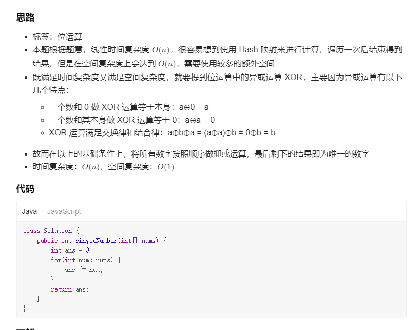

方法一：位运算  异或

因此，数组中的全部元素的异或运算结果即为数组中只出现一次的数字。

JavaC++Python3C#Golang

class Solution {
public int singleNumber(int[] nums) {
int single = 0;
for (int num : nums) {
single ^= num;
}
return single;
}
}
复杂度分析

时间复杂度：O(n)，其中 n 是数组长度。只需要对数组遍历一次。

空间复杂度：O(1)。