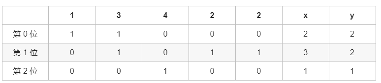

方法二：二进制
思路和算法
这个方法我们来将所有数二进制展开按位考虑如何找出重复的数，如果我们能确定重复数每一位是 1 还是 0 就可以按位还原出重复的数是什么。

考虑到第 i 位，我们记 nums 数组中二进制展开后第 i 位为 1 的数有 x 个，数字 [1,n] 这 n 个数二进制展开后第 i 位为 1 的数有 y 个，那么重复的数第 i位为 1 当且仅当 x>y。

仍然以示例 1 为例，如下的表格列出了每个数字二进制下每一位是 1 还是 0 以及对应位的 x 和 y 是多少：

1	3	4	2	2	x	y
第 0 位	1	1	0	0	0	2	2
第 1 位	0	1	0	1	1	3	2
第 2 位	0	0	1	0	0	1	1
那么按之前说的我们发现只有第 1 位x>y ，所以按位还原后 (010)

，符合答案。

正确性的证明其实和方法一类似，我们可以按方法一的方法，考虑不同示例数组中第 i 位 1 的个数 x 的变化：

如果测试用例的数组中 target 出现了两次，其余的数各出现了一次，且 target 的第 i 位为 1，那么 nums 数组中第 i位 1 的个数 x 恰好比 y 大一。如果target 的第 i 位为 0，
那么两者相等。
如果测试用例的数组中 target 出现了三次及以上，那么必然有一些数不在nums 数组中了，这个时候相当于我们用 target 去替换了这些数，我们考虑替换的时候对 x 的影响：
如果被替换的数第 i 位为 1，且 target 第 i 位为 1：x 不变，满足 x>y。
如果被替换的数第 i 位为 0，且 target 第 i 位为 1：x 加一，满足 x>y。
如果被替换的数第 i 位为 1，且 target 第 i 位为 0：x 减一，满足 x≤y。
如果被替换的数第 i 位为 0，且 target 第 i 位为 0：x 不变，满足 x≤y。
也就是说如果 target 第 i 位为 1，那么每次替换后只会使 xx 不变或增大，如果为 0，只会使 x 不变或减小，始终满足 x>y 时 target 第 i 位为 1，
否则为 0，因此我们只要按位还原这个重复的数即可。

复杂度证明

时间复杂度：O(nlogn)，其中 n 为 nums 数组的长度。O(logn) 代表了我们枚举二进制数的位数个数，枚举第 i 位的时候需要遍历数组统计 x 和 y 的答案，
因此总时间复杂度为 O(nlogn)。

空间复杂度：O(1)。我们只需要常数空间存放若干变量。
