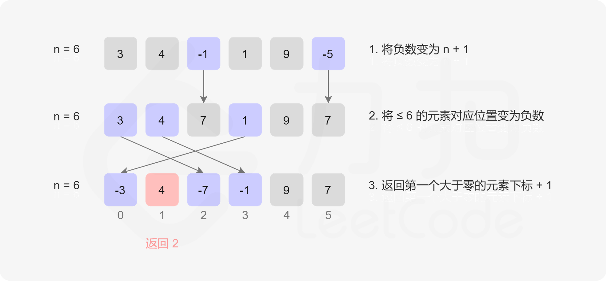

我们可以将数组所有的数放入哈希表，随后从 1 开始依次枚举正整数，并判断其是否在哈希表中。

仔细想一想，我们为什么要使用哈希表？这是因为哈希表是一个可以支持快速查找的数据结构：给定一个元素，我们可以在 O(1) 的时间查找该元素是否在哈希表中。
因此，我们可以考虑将给定的数组设计成哈希表的「替代产品」。

实际上，对于一个长度为 N 的数组，其中没有出现的最小正整数只能在 [1,N+1] 中。这是因为如果 [1,N] 都出现了，那么答案是 N+1，否则答案是 [1,N]
中没有出现的最小正整数。这样一来，我们将所有在 [1,N] 范围内的数放入哈希表，也可以得到最终的答案。而给定的数组恰好长度为 N，这让我们有了一种将数组设计成哈希表的思路：

我们对数组进行遍历，对于遍历到的数 x，如果它在 [1,N] 的范围内，那么就将数组中的第 x−1 个位置（注意：数组下标从 0 开始）打上「标记」。在遍历结束之后，
如果所有的位置都被打上了标记，那么答案是 N+1，否则答案是最小的没有打上标记的位置加 1。

那么如何设计这个「标记」呢？由于数组中的数没有任何限制，因此这并不是一件容易的事情。但我们可以继续利用上面的提到的性质：由于我们只在意 [1,N] 中的数，
因此我们可以先对数组进行遍历，把不在 [1,N] 范围内的数修改成任意一个大于 N 的数（例如 N+1）。这样一来，数组中的所有数就都是正数了，因此我们就可以将「标记」表示为「负号」。
算法的流程如下：

我们将数组中所有小于等于 0 的数修改为 N+1；

我们遍历数组中的每一个数 x，它可能已经被打了标记，因此原本对应的数为 ∣x∣，其中 ∣∣ 为绝对值符号。如果 ∣x∣∈[1,N]，那么我们给数组中的第 ∣x∣−1 个位置的数添加一个负号。
注意如果它已经有负号，不需要重复添加；

在遍历完成之后，如果数组中的每一个数都是负数，那么答案是 N+1，否则答案是第一个正数的位置加 1。
