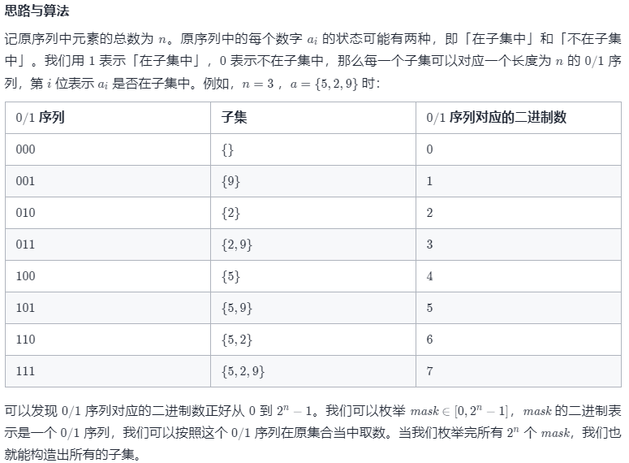

方法一：迭代法实现子集枚举
思路与算法

代码

C++JavaGolangJavaScriptC

class Solution {
List<Integer> t = new ArrayList<Integer>();
List<List<Integer>> ans = new ArrayList<List<Integer>>();

    public List<List<Integer>> subsets(int[] nums) {
        int n = nums.length;
        for (int mask = 0; mask < (1 << n); ++mask) {
            t.clear();
            for (int i = 0; i < n; ++i) {
                if ((mask & (1 << i)) != 0) {
                    t.add(nums[i]);
                }
            }
            ans.add(new ArrayList<Integer>(t));
        }
        return ans;
    }
}
复杂度分析

时间复杂度：O(n × 2^n)。一共 2^n个状态，每种状态需要 O(n) 的时间来构造子集。

空间复杂度：O(n)。即构造子集使用的临时数组 t 的空间代价。
