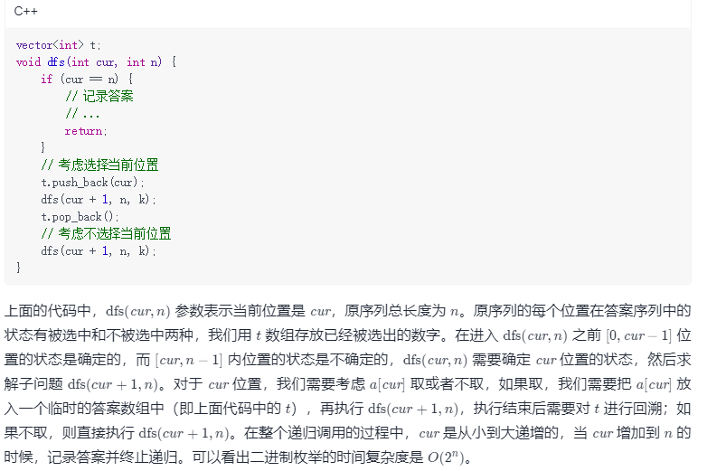

方法二：递归法实现子集枚举
思路与算法

我们也可以用递归来实现子集枚举。

假设我们需要找到一个长度为 nn 的序列 aa 的所有子序列，代码框架是这样的：

class Solution {
List<Integer> t = new ArrayList<Integer>();
List<List<Integer>> ans = new ArrayList<List<Integer>>();

    public List<List<Integer>> subsets(int[] nums) {
        dfs(0, nums);
        return ans;
    }

    public void dfs(int cur, int[] nums) {
        if (cur == nums.length) {
            ans.add(new ArrayList<Integer>(t));
            return;
        }
        t.add(nums[cur]);
        dfs(cur + 1, nums);
        t.remove(t.size() - 1);
        dfs(cur + 1, nums);
    }
}
复杂度分析

时间复杂度：O(n × 2 ^ n)个状态，每种状态需要 O(n) 的时间来构造子集。

空间复杂度：O(n)。临时数组 t 的空间代价是 O(n)，递归时栈空间的代价为 O(n)。
