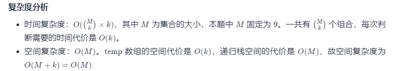

方法二：组合枚举
思路与算法

我们可以换一个思路：我们需要在 9 个数中选择 k 个数，让它们的和为 n。

这样问题就变成了一个组合枚举问题。组合枚举有两种处理方法——递归法和字典序法，在「77. 组合的官方题解」中有详细的说明。

这里我们要做的是做一个「在 9 个数中选择 k 个数」的组合枚举，对于枚举到的所有组合，判断这个组合内元素之和是否为 n。

代码如下。

代码

C++JavaJavaScriptGolangC

class Solution {
List<Integer> temp = new ArrayList<Integer>();
List<List<Integer>> ans = new ArrayList<List<Integer>>();

    public List<List<Integer>> combinationSum3(int k, int n) {
        dfs(1, 9, k, n);
        return ans;
    }

    public void dfs(int cur, int n, int k, int sum) {
        if (temp.size() + (n - cur + 1) < k || temp.size() > k) {
            return;
        }
        if (temp.size() == k) {
            int tempSum = 0;
            for (int num : temp) {
                tempSum += num;
            }
            if (tempSum == sum) {
                ans.add(new ArrayList<Integer>(temp));
                return;
            }
        }
        temp.add(cur);
        dfs(cur + 1, n, k, sum);
        temp.remove(temp.size() - 1);
        dfs(cur + 1, n, k, sum);
    }
}
