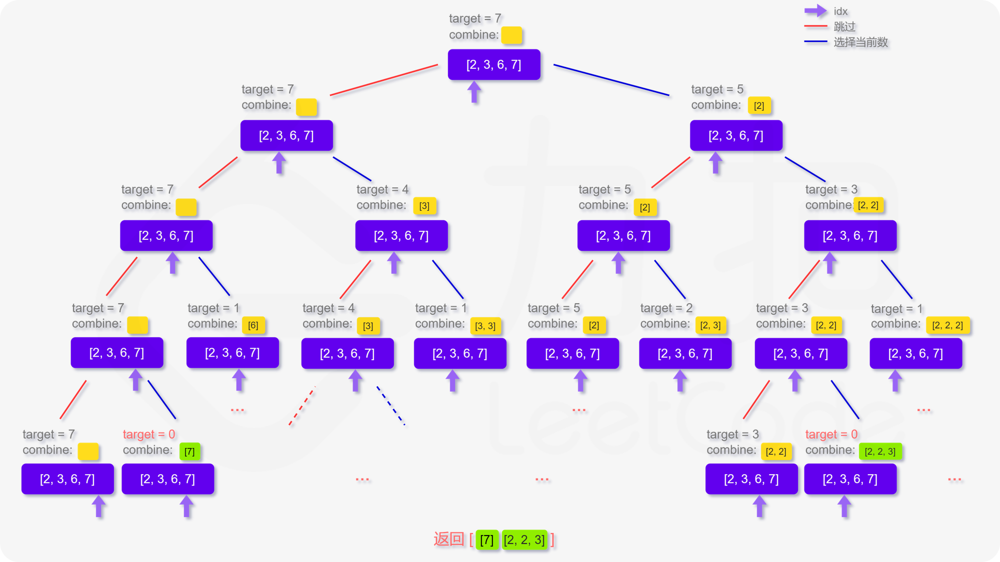

方法一：搜索回溯
思路与算法

对于这类寻找所有可行解的题，我们都可以尝试用「搜索回溯」的方法来解决。

回到本题，我们定义递归函数 dfs(target, combine, idx) 表示当前在 candidates 数组的第 idx 位，还剩 target 要组合，已经组合的列表为 combine。递归的终止条件为 target <= 0 
或者 candidates 数组被全部用完。那么在当前的函数中，每次我们可以选择跳过不用第 idx 个数，即执行 dfs(target, combine, idx + 1)。也可以选择使用第 idx 个数，
即执行 dfs(target - candidates[idx], combine, idx)，注意到每个数字可以被无限制重复选取，因此搜索的下标仍为 idx。

更形象化地说，如果我们将整个搜索过程用一个树来表达，即如下图呈现，每次的搜索都会延伸出两个分叉，直到递归的终止条件，这样我们就能不重复且不遗漏地找到所有可行解：

当然，搜索回溯的过程一定存在一些优秀的剪枝方法来使得程序运行得更快，而这里只给出了最朴素不含剪枝的写法，因此欢迎各位读者在评论区分享自己的见解。
class Solution {
public List<List<Integer>> combinationSum(int[] candidates, int target) {
List<List<Integer>> ans = new ArrayList<List<Integer>>();
List<Integer> combine = new ArrayList<Integer>();
dfs(candidates, target, ans, combine, 0);
return ans;
}

    public void dfs(int[] candidates, int target, List<List<Integer>> ans, List<Integer> combine, int idx) {
        if (idx == candidates.length) {
            return;
        }
        if (target == 0) {
            ans.add(new ArrayList<Integer>(combine));
            return;
        }
        // 直接跳过
        dfs(candidates, target, ans, combine, idx + 1);
        // 选择当前数
        if (target - candidates[idx] >= 0) {
            combine.add(candidates[idx]);
            dfs(candidates, target - candidates[idx], ans, combine, idx);
            combine.remove(combine.size() - 1);
        }
    }
}
复杂度分析

时间复杂度：O(S)，其中 SS 为所有可行解的长度之和。从分析给出的搜索树我们可以看出时间复杂度取决于搜索树所有叶子节点的深度之和，即所有可行解的长度之和。在这题中，我们很难给出一个比较紧的上界，
我们知道 O(n × 2^n) 是一个比较松的上界，即在这份代码中，nn 个位置每次考虑选或者不选，如果符合条件，就加入答案的时间代价。但是实际运行的时候，因为不可能所有的解都满足条件，
递归的时候我们还会用 target - candidates[idx] >= 0 进行剪枝，所以实际运行情况是远远小于这个上界的。

空间复杂度：O(target)。除答案数组外，空间复杂度取决于递归的栈深度，在最差情况下需要递归 O(target) 层。
