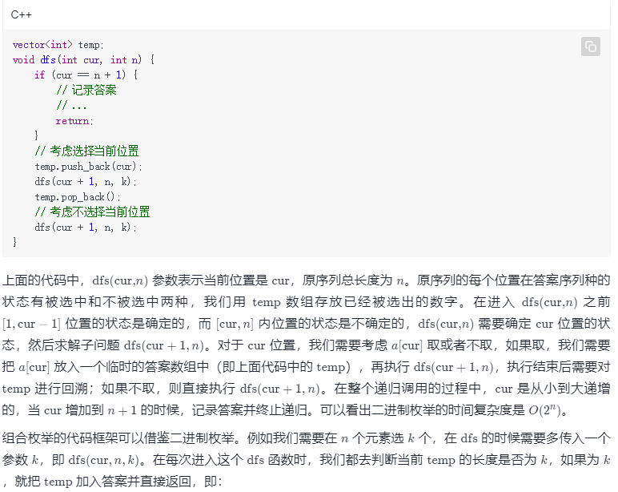
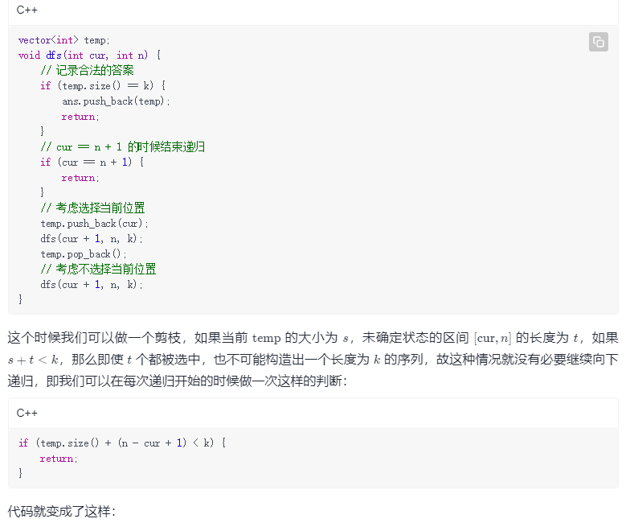
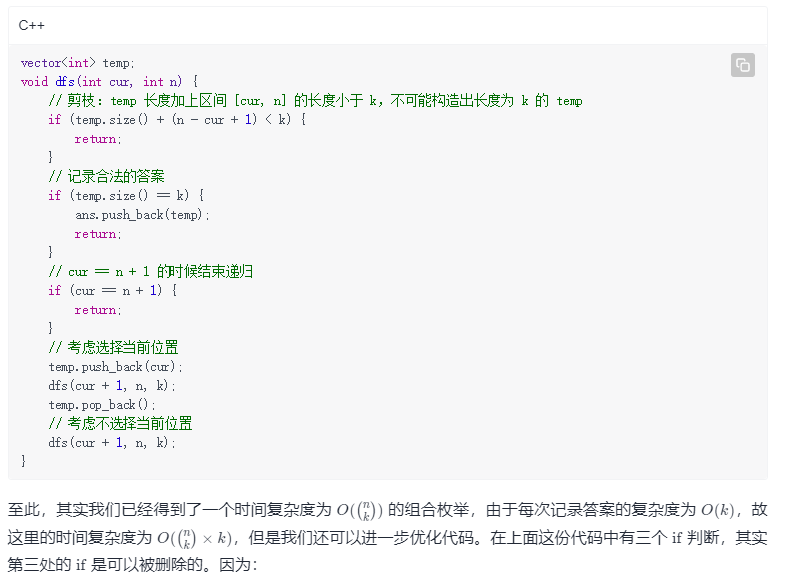
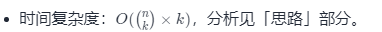

方法一：递归实现组合型枚举
思路与算法

从 n 个当中选 k 个的所有方案对应的枚举是组合型枚举。在「方法一」中我们用递归来实现组合型枚举。

首先我们先回忆一下如何用递归实现二进制枚举（子集枚举），假设我们需要找到一个长度为 nn 的序列 aa 的所有子序列，代码框架是这样的：

首先，cur=n+1 的时候，一定不可能出现 s>k（s 是前文中定义的 temp 的大小），因为自始至终 s 绝不可能大于 k，它等于 k 的时候就会被第二处 if 记录答案并返回；
如果 cur=n+1 的时候 s=k，它也会被第二处 if 记录答案并返回；
如果 cur=n+1 的时候 s<k，一定会在 cur<n+1 的某个位置的时候发现 s+t<k，它也会被第一处 if 剪枝。
因此，第三处 if 可以删除。最终我们得到了如下的代码。

代码

C++JavaJavaScriptGolangC

class Solution {
List<Integer> temp = new ArrayList<Integer>();
List<List<Integer>> ans = new ArrayList<List<Integer>>();

    public List<List<Integer>> combine(int n, int k) {
        dfs(1, n, k);
        return ans;
    }

    public void dfs(int cur, int n, int k) {
        // 剪枝：temp 长度加上区间 [cur, n] 的长度小于 k，不可能构造出长度为 k 的 temp
        if (temp.size() + (n - cur + 1) < k) {
            return;
        }
        // 记录合法的答案
        if (temp.size() == k) {
            ans.add(new ArrayList<Integer>(temp));
            return;
        }
        // 考虑选择当前位置
        temp.add(cur);
        dfs(cur + 1, n, k);
        temp.remove(temp.size() - 1);
        // 考虑不选择当前位置
        dfs(cur + 1, n, k);
    }
}
复杂度分析

空间复杂度：O(n+k)=O(n)，即递归使用栈空间的空间代价和临时数组 temp 的空间代价。
