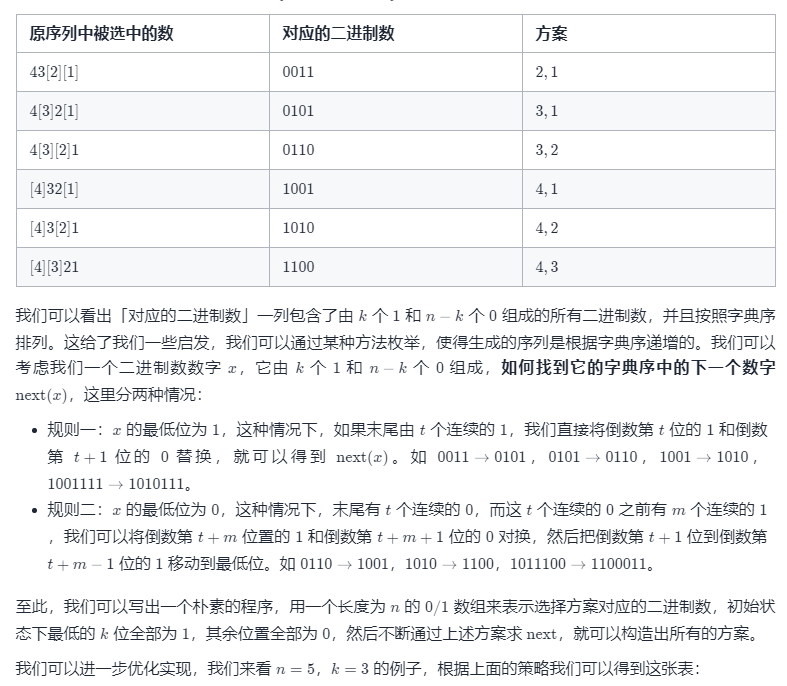
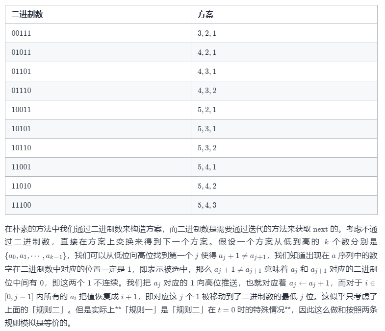
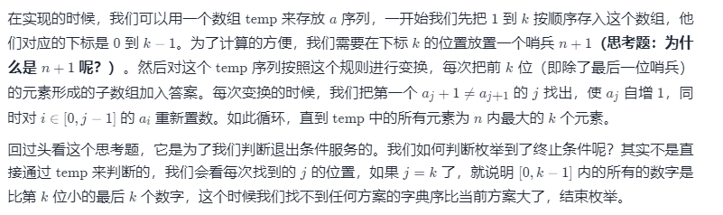

方法二：非递归（字典序法）实现组合型枚举
思路与算法

小贴士：这个方法理解起来比「方法一」复杂，建议读者遇到不理解的地方可以在草稿纸上举例模拟这个过程。

这里的非递归版不是简单的用栈模拟递归转化为非递归：我们希望通过合适的手段，消除递归栈带来的额外空间代价。

假设我们把原序列中被选中的位置记为 1，不被选中的位置记为 0，对于每个方案都可以构造出一个二进制数。我们让原序列从大到小排列（即 {n,n−1,⋯1,0}）。
我们先看一看 n=4，k=2 的例子：

class Solution {
List<Integer> temp = new ArrayList<Integer>();
List<List<Integer>> ans = new ArrayList<List<Integer>>();

    public List<List<Integer>> combine(int n, int k) {
        List<Integer> temp = new ArrayList<Integer>();
        List<List<Integer>> ans = new ArrayList<List<Integer>>();
        // 初始化
        // 将 temp 中 [0, k - 1] 每个位置 i 设置为 i + 1，即 [0, k - 1] 存 [1, k]
        // 末尾加一位 n + 1 作为哨兵
        for (int i = 1; i <= k; ++i) {
            temp.add(i);
        }
        temp.add(n + 1);
        
        int j = 0;
        while (j < k) {
            ans.add(new ArrayList<Integer>(temp.subList(0, k)));
            j = 0;
            // 寻找第一个 temp[j] + 1 != temp[j + 1] 的位置 t
            // 我们需要把 [0, t - 1] 区间内的每个位置重置成 [1, t]
            while (j < k && temp.get(j) + 1 == temp.get(j + 1)) {
                temp.set(j, j + 1);
                ++j;
            }
            // j 是第一个 temp[j] + 1 != temp[j + 1] 的位置
            temp.set(j, temp.get(j) + 1);
        }
        return ans;
    }
}
