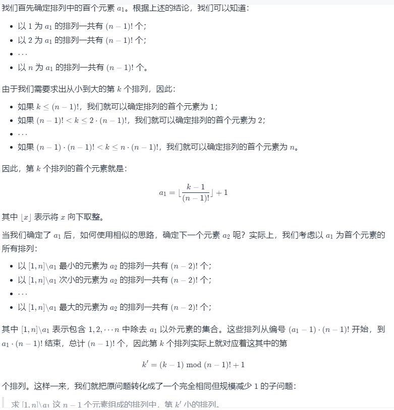
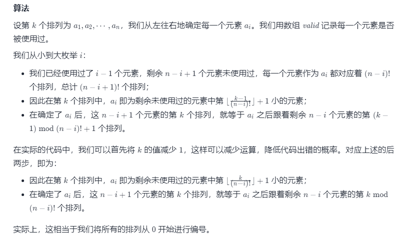
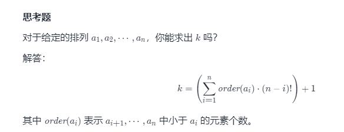

方法一：数学 + 缩小问题规模
思路

要想解决本题，首先需要了解一个简单的结论：

对于 n 个不同的元素（例如数 1,2,⋯,n），它们可以组成的排列总数目为 n!。

对于给定的 n 和 k，我们不妨从左往右确定第 k 个排列中的每一个位置上的元素到底是什么。

算法

代码

C++JavaPython3GolangC

class Solution {
public String getPermutation(int n, int k) {
int[] factorial = new int[n];
factorial[0] = 1;
for (int i = 1; i < n; ++i) {
factorial[i] = factorial[i - 1] * i;
}

        --k;
        StringBuffer ans = new StringBuffer();
        int[] valid = new int[n + 1];
        Arrays.fill(valid, 1);
        for (int i = 1; i <= n; ++i) {
            int order = k / factorial[n - i] + 1;
            for (int j = 1; j <= n; ++j) {
                order -= valid[j];
                if (order == 0) {
                    ans.append(j);
                    valid[j] = 0;
                    break;
                }
            }
            k %= factorial[n - i];
        }
        return ans.toString();
    }
}
复杂度分析

时间复杂度：O(n^2)。

空间复杂度：O(n)。

