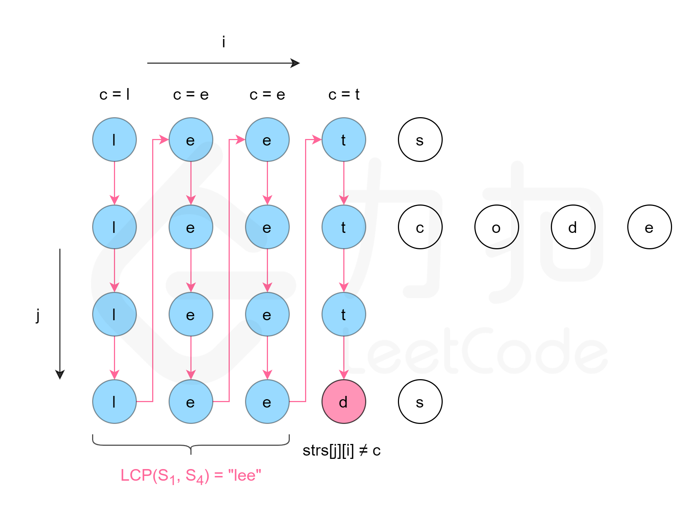

方法二：纵向扫描
方法一是横向扫描，依次遍历每个字符串，更新最长公共前缀。另一种方法是纵向扫描。纵向扫描时，从前往后遍历所有字符串的每一列，比较相同列上的字符是否相同，如果相同则继续对下一列进行比较，
如果不相同则当前列不再属于公共前缀，当前列之前的部分为最长公共前缀。

复杂度分析

时间复杂度：O(mn)，其中 m 是字符串数组中的字符串的平均长度，n 是字符串的数量。最坏情况下，字符串数组中的每个字符串的每个字符都会被比较一次。

空间复杂度：O(1)。使用的额外空间复杂度为常数。
