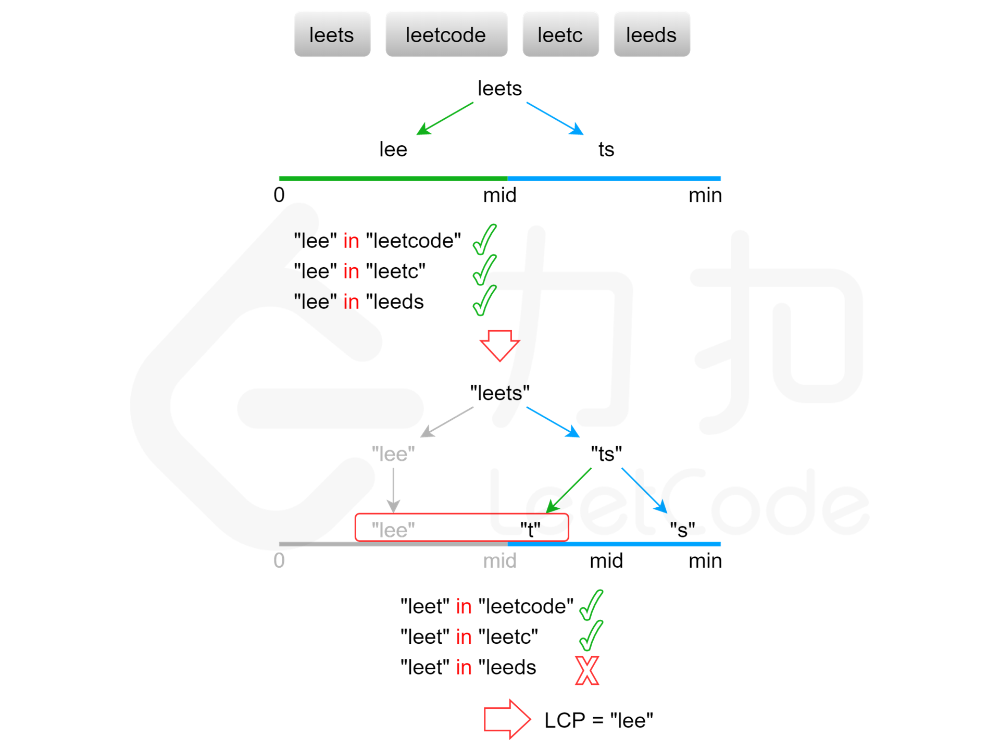

方法四：二分查找
显然，最长公共前缀的长度不会超过字符串数组中的最短字符串的长度。用 minLength 表示字符串数组中的最短字符串的长度，则可以在 [0,minLength] 的范围内通过二分查找得到最长公共前缀的长度。
每次取查找范围的中间值 mid，判断每个字符串的长度为 mid 的前缀是否相同，如果相同则最长公共前缀的长度一定大于或等于 mid，如果不相同则最长公共前缀的长度一定小于 mid，
通过上述方式将查找范围缩小一半，直到得到最长公共前缀的长度。

复杂度分析

时间复杂度：O(mnlogm)，其中 m 是字符串数组中的字符串的最小长度，n 是字符串的数量。二分查找的迭代执行次数是 O(logm)，每次迭代最多需要比较 mn 个字符，因此总时间复杂度是 O(mnlogm)。

空间复杂度：O(1)。使用的额外空间复杂度为常数。
