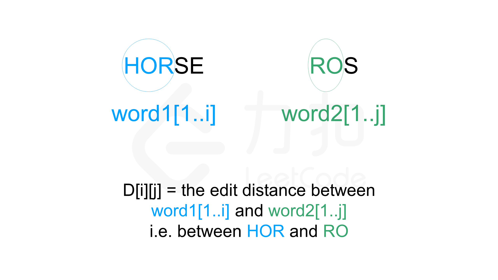

编辑距离算法被数据科学家广泛应用，是用作机器翻译和语音识别评价标准的基本算法。

最直观的方法是暴力检查所有可能的编辑方法，取最短的一个。所有可能的编辑方法达到指数级，但我们不需要进行这么多计算，因为我们只需要找到距离最短的序列而不是所有可能的序列。
class Solution {
public:
int minDistance(string word1, string word2) {
int m = word1.size(), n = word2.size();
vector<vector<int>> memo(m, vector<int>(n));
return helper(word1, 0, word2, 0, memo);
}
int helper(string& word1, int i, string& word2, int j, vector<vector<int>>& memo) {
if (i == word1.size()) return (int)word2.size() - j;
if (j == word2.size()) return (int)word1.size() - i;
if (memo[i][j] > 0) return memo[i][j];
int res = 0;
if (word1[i] == word2[j]) {
return helper(word1, i + 1, word2, j + 1, memo);
} else {
int insertCnt = helper(word1, i, word2, j + 1, memo);
int deleteCnt = helper(word1, i + 1, word2, j, memo);
int replaceCnt = helper(word1, i + 1, word2, j + 1, memo);
res = min(insertCnt, min(deleteCnt, replaceCnt)) + 1;
}
return memo[i][j] = res;
}
};
方法一：动态规划
思路和算法

我们可以对任意一个单词进行三种操作：

插入一个字符；

删除一个字符；

替换一个字符。

题目给定了两个单词，设为 A 和 B，这样我们就能够六种操作方法。

但我们可以发现，如果我们有单词 A 和单词 B：

对单词 A 删除一个字符和对单词 B 插入一个字符是等价的。例如当单词 A 为 doge，单词 B 为 dog 时，我们既可以删除单词 A 的最后一个字符 e，得到相同的 dog，也可以在单词 B 末尾添加一个字符 e，得到相同的 doge；

同理，对单词 B 删除一个字符和对单词 A 插入一个字符也是等价的；

对单词 A 替换一个字符和对单词 B 替换一个字符是等价的。例如当单词 A 为 bat，单词 B 为 cat 时，我们修改单词 A 的第一个字母 b -> c，和修改单词 B 的第一个字母 c -> b 是等价的。

这样以来，本质不同的操作实际上只有三种：

在单词 A 中插入一个字符；

在单词 B 中插入一个字符；

修改单词 A 的一个字符。

这样以来，我们就可以把原问题转化为规模较小的子问题。我们用 A = horse，B = ros 作为例子，来看一看是如何把这个问题转化为规模较小的若干子问题的。

在单词 A 中插入一个字符：如果我们知道 horse 到 ro 的编辑距离为 a，那么显然 horse 到 ros 的编辑距离不会超过 a + 1。这是因为我们可以在 a 次操作后将 horse 和 ro 变为相同的字符串，只需要额外的 1 次操作，在单词 A 的末尾添加字符 s，就能在 a + 1 次操作后将 horse 和 ro 变为相同的字符串；

在单词 B 中插入一个字符：如果我们知道 hors 到 ros 的编辑距离为 b，那么显然 horse 到 ros 的编辑距离不会超过 b + 1，原因同上；

修改单词 A 的一个字符：如果我们知道 hors 到 ro 的编辑距离为 c，那么显然 horse 到 ros 的编辑距离不会超过 c + 1，原因同上。

那么从 horse 变成 ros 的编辑距离应该为 min(a + 1, b + 1, c + 1)。

注意：为什么我们总是在单词 A 和 B 的末尾插入或者修改字符，能不能在其它的地方进行操作呢？答案是可以的，但是我们知道，操作的顺序是不影响最终的结果的。例如对于单词 cat，
我们希望在 c 和 a 之间添加字符 d 并且将字符 t 修改为字符 b，那么这两个操作无论为什么顺序，都会得到最终的结果 cdab。

你可能觉得 horse 到 ro 这个问题也很难解决。但是没关系，我们可以继续用上面的方法拆分这个问题，对于这个问题拆分出来的所有子问题，我们也可以继续拆分，直到：

字符串 A 为空，如从 转换到 ro，显然编辑距离为字符串 B 的长度，这里是 2；

字符串 B 为空，如从 horse 转换到 ，显然编辑距离为字符串 A 的长度，这里是 5。

因此，我们就可以使用动态规划来解决这个问题了。我们用 D[i][j] 表示 A 的前 i 个字母和 B 的前 j 个字母之间的编辑距离。

如上所述，当我们获得 D[i][j-1]，D[i-1][j] 和 D[i-1][j-1] 的值之后就可以计算出 D[i][j]。

D[i][j-1] 为 A 的前 i 个字符和 B 的前 j - 1 个字符编辑距离的子问题。即对于 B 的第 j 个字符，我们在 A 的末尾添加了一个相同的字符，那么 D[i][j] 最小可以为 D[i][j-1] + 1；

D[i-1][j] 为 A 的前 i - 1 个字符和 B 的前 j 个字符编辑距离的子问题。即对于 A 的第 i 个字符，我们在 B 的末尾添加了一个相同的字符，那么 D[i][j] 最小可以为 D[i-1][j] + 1；

D[i-1][j-1] 为 A 前 i - 1 个字符和 B 的前 j - 1 个字符编辑距离的子问题。即对于 B 的第 j 个字符，我们修改 A 的第 i 个字符使它们相同，那么 D[i][j] 最小可以为 D[i-1][j-1] + 1。
特别地，如果 A 的第 i 个字符和 B 的第 j 个字符原本就相同，那么我们实际上不需要进行修改操作。在这种情况下，D[i][j] 最小可以为 D[i-1][j-1]。

那么我们可以写出如下的状态转移方程：

若 A 和 B 的最后一个字母相同：

D[i][j]

=min(D[i][j−1]+1,D[i−1][j]+1,D[i−1][j−1])
=1+min(D[i][j−1],D[i−1][j],D[i−1][j−1]−1)
  

若 A 和 B 的最后一个字母不同：

D[i][j] = 1+min(D[i][j−1],D[i−1][j],D[i−1][j−1])

所以每一步结果都将基于上一步的计算结果，示意如下：

对于边界情况，一个空串和一个非空串的编辑距离为 D[i][0] = i 和 D[0][j] = j，D[i][0] 相当于对 word1 执行 i 次删除操作，D[0][j] 相当于对 word1执行 j 次插入操作。

综上我们得到了算法的全部流程。

1 / 19

JavaPython3C++

class Solution {
public int minDistance(String word1, String word2) {
int n = word1.length();
int m = word2.length();

        // 有一个字符串为空串
        if (n * m == 0) {
            return n + m;
        }

        // DP 数组
        int[][] D = new int[n + 1][m + 1];

        // 边界状态初始化
        for (int i = 0; i < n + 1; i++) {
            D[i][0] = i;
        }
        for (int j = 0; j < m + 1; j++) {
            D[0][j] = j;
        }

        // 计算所有 DP 值
        for (int i = 1; i < n + 1; i++) {
            for (int j = 1; j < m + 1; j++) {
                int left = D[i - 1][j] + 1;
                int down = D[i][j - 1] + 1;
                int left_down = D[i - 1][j - 1];
                if (word1.charAt(i - 1) != word2.charAt(j - 1)) {
                    left_down += 1;
                }
                D[i][j] = Math.min(left, Math.min(down, left_down));
            }
        }
        return D[n][m];
    }
}
复杂度分析

时间复杂度 ：O(mn)，其中 m 为 word1 的长度，n 为 word2 的长度。

空间复杂度 ：O(mn)，我们需要大小为 O(mn) 的 D 数组来记录状态值。
