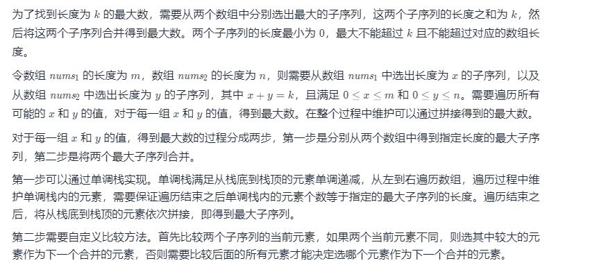
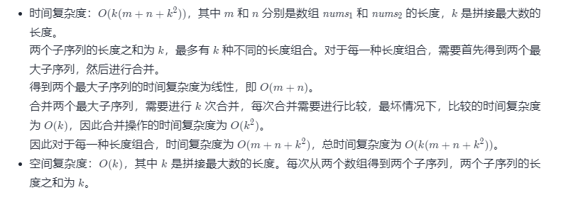

方法一：单调栈

在下面的代码中，单调栈使用数组实现，数组最左侧为栈底。使用数组实现，可以直接从左到右遍历数组得到最大子序列。
JavaC++JavaScriptPython3GolangC

class Solution {
public int[] maxNumber(int[] nums1, int[] nums2, int k) {
int m = nums1.length, n = nums2.length;
int[] maxSubsequence = new int[k];
int start = Math.max(0, k - n), end = Math.min(k, m);
for (int i = start; i <= end; i++) {
int[] subsequence1 = maxSubsequence(nums1, i);
int[] subsequence2 = maxSubsequence(nums2, k - i);
int[] curMaxSubsequence = merge(subsequence1, subsequence2);
if (compare(curMaxSubsequence, 0, maxSubsequence, 0) > 0) {
System.arraycopy(curMaxSubsequence, 0, maxSubsequence, 0, k);
}
}
return maxSubsequence;
}

    public int[] maxSubsequence(int[] nums, int k) {
        int length = nums.length;
        int[] stack = new int[k];
        int top = -1;
        int remain = length - k;
        for (int i = 0; i < length; i++) {
            int num = nums[i];
            while (top >= 0 && stack[top] < num && remain > 0) {
                top--;
                remain--;
            }
            if (top < k - 1) {
                stack[++top] = num;
            } else {
                remain--;
            }
        }
        return stack;
    }

    public int[] merge(int[] subsequence1, int[] subsequence2) {
        int x = subsequence1.length, y = subsequence2.length;
        if (x == 0) {
            return subsequence2;
        }
        if (y == 0) {
            return subsequence1;
        }
        int mergeLength = x + y;
        int[] merged = new int[mergeLength];
        int index1 = 0, index2 = 0;
        for (int i = 0; i < mergeLength; i++) {
            if (compare(subsequence1, index1, subsequence2, index2) > 0) {
                merged[i] = subsequence1[index1++];
            } else {
                merged[i] = subsequence2[index2++];
            }
        }
        return merged;
    }

    public int compare(int[] subsequence1, int index1, int[] subsequence2, int index2) {
        int x = subsequence1.length, y = subsequence2.length;
        while (index1 < x && index2 < y) {
            int difference = subsequence1[index1] - subsequence2[index2];
            if (difference != 0) {
                return difference;
            }
            index1++;
            index2++;
        }
        return (x - index1) - (y - index2);
    }
}
复杂度分析

