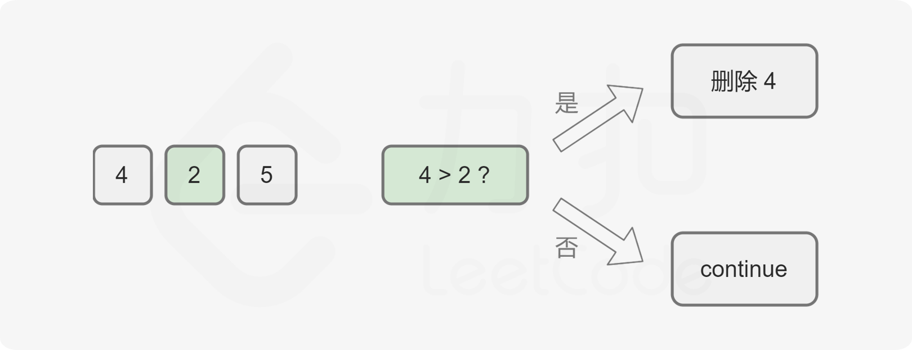
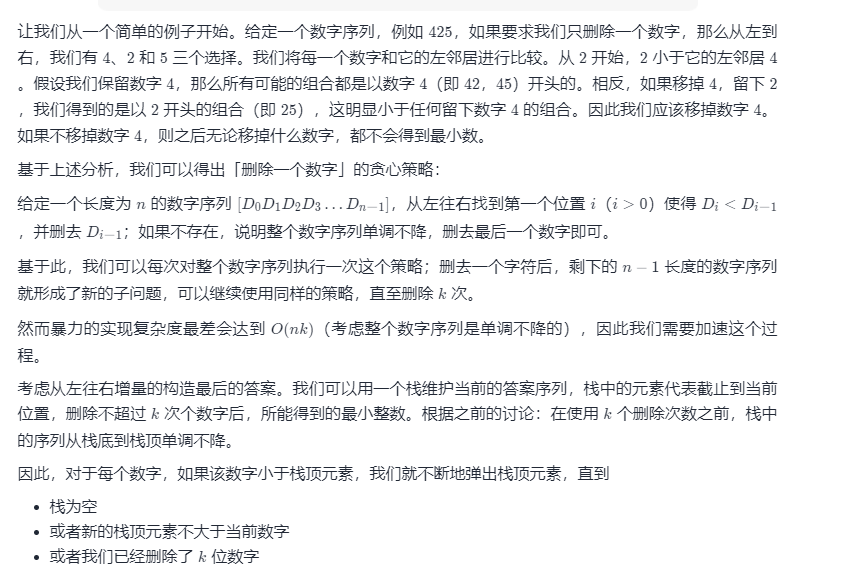

方法一：贪心 + 单调栈
对于两个相同长度的数字序列，最左边不同的数字决定了这两个数字的大小，例如，对于 A = 1axxx，B = 1bxxx，如果 a>b 则 A>B。

基于此，我们可以知道，若要使得剩下的数字最小，需要保证靠前的数字尽可能小。

上述步骤结束后我们还需要针对一些情况做额外的处理：

如果我们删除了 m 个数字且 m<k，这种情况下我们需要从序列尾部删除额外的 k−m 个数字。
如果最终的数字序列存在前导零，我们要删去前导零。
如果最终数字序列为空，我们应该返回 0。
最终，从栈底到栈顶的答案序列即为最小数。

考虑到栈的特点是后进先出，如果通过栈实现，则需要将栈内元素依次弹出然后进行翻转才能得到最小数。为了避免翻转操作，可以使用双端队列代替栈的实现。

C++JavaJavaScriptPython3GolangC

class Solution {
public String removeKdigits(String num, int k) {
Deque<Character> deque = new LinkedList<Character>();
int length = num.length();
for (int i = 0; i < length; ++i) {
char digit = num.charAt(i);
while (!deque.isEmpty() && k > 0 && deque.peekLast() > digit) {
deque.pollLast();
k--;
}
deque.offerLast(digit);
}

        for (int i = 0; i < k; ++i) {
            deque.pollLast();
        }
        
        StringBuilder ret = new StringBuilder();
        boolean leadingZero = true;
        while (!deque.isEmpty()) {
            char digit = deque.pollFirst();
            if (leadingZero && digit == '0') {
                continue;
            }
            leadingZero = false;
            ret.append(digit);
        }
        return ret.length() == 0 ? "0" : ret.toString();
    }
}
复杂度分析

时间复杂度：O(n)，其中 n 为字符串的长度。尽管存在嵌套循环，但内部循环最多运行 k 次。由于 0<k≤n，主循环的时间复杂度被限制在 2n 以内。
对于主循环之外的逻辑，它们的时间复杂度是 O(n)，因此总时间复杂度为 O(n)。

空间复杂度：O(n)。栈存储数字需要线性的空间。
