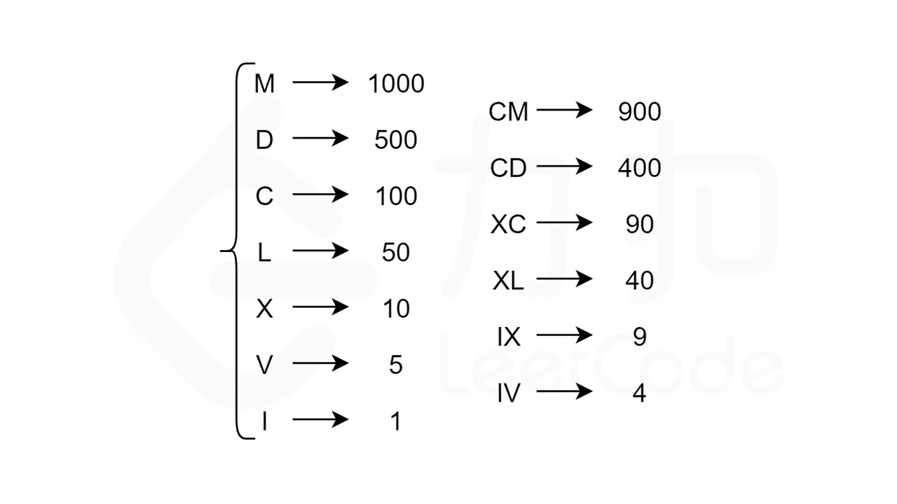
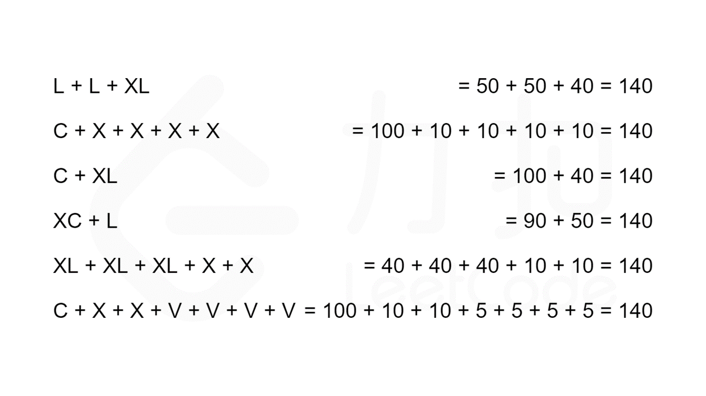

罗马数字包含以下七种字符： I， V， X， L，C，D 和 M。

字符          数值
I             1
V             5
X             10
L             50
C             100
D             500
M             1000
例如， 罗马数字 2 写做 II ，即为两个并列的 1。12 写做 XII ，即为 X + II 。 27 写做  XXVII, 即为 XX + V + II 。

通常情况下，罗马数字中小的数字在大的数字的右边。但也存在特例，例如 4 不写做 IIII，而是 IV。数字 1 在数字 5 的左边，所表示的数等于大数 5 减小数 1 得到的数值 4 。同样地，数字 9 表示为 IX。这个特殊的规则只适用于以下六种情况：

I 可以放在 V (5) 和 X (10) 的左边，来表示 4 和 9。
X 可以放在 L (50) 和 C (100) 的左边，来表示 40 和 90。
C 可以放在 D (500) 和 M (1000) 的左边，来表示 400 和 900。
给你一个整数，将其转为罗马数字。

 

示例 1:

输入: num = 3
输出: "III"
示例 2:

输入: num = 4
输出: "IV"
示例 3:

输入: num = 9
输出: "IX"
示例 4:

输入: num = 58
输出: "LVIII"
解释: L = 50, V = 5, III = 3.
示例 5:

输入: num = 1994
输出: "MCMXCIV"
解释: M = 1000, CM = 900, XC = 90, IV = 4.

提示：

1 <= num <= 3999

考虑 140140 的罗马数字表示，下面哪一个是正确的？

我们用来确定罗马数字的规则是：对于罗马数字从左到右的每一位，选择尽可能大的符号值。对于 140，最大可以选择的符号值为 C=100。接下来，对于剩余的数字 40，
最大可以选择的符号值为 XL=40。因此，140 的对应的罗马数字为 C+XL=CXL。
