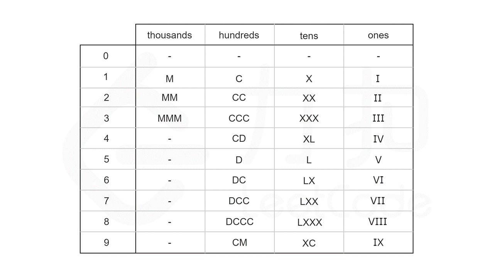

回顾前言中列出的这 13 个符号，可以发现：

千位数字只能由 M 表示；
百位数字只能由 C，CD，D 和 CM 表示；
十位数字只能由 X，XL，L 和 XC 表示；
个位数字只能由 I，IV，V 和 IX 表示。
这恰好把这 13 个符号分为四组，且组与组之间没有公共的符号。因此，整数 num 的十进制表示中的每一个数字都是可以单独处理的。

进一步地，我们可以计算出每个数字在每个位上的表示形式，整理成一张硬编码表。如下图所示，其中 0 对应的是空字符串。

利用模运算和除法运算，我们可以得到 num 每个位上的数字：

thousands_digit = num / 1000
hundreds_digit = (num % 1000) / 100
tens_digit = (num % 100) / 10
ones_digit = num % 10

最后，根据 num 每个位上的数字，在硬编码表中查找对应的罗马字符，并将结果拼接在一起，即为 num 对应的罗马数字。
