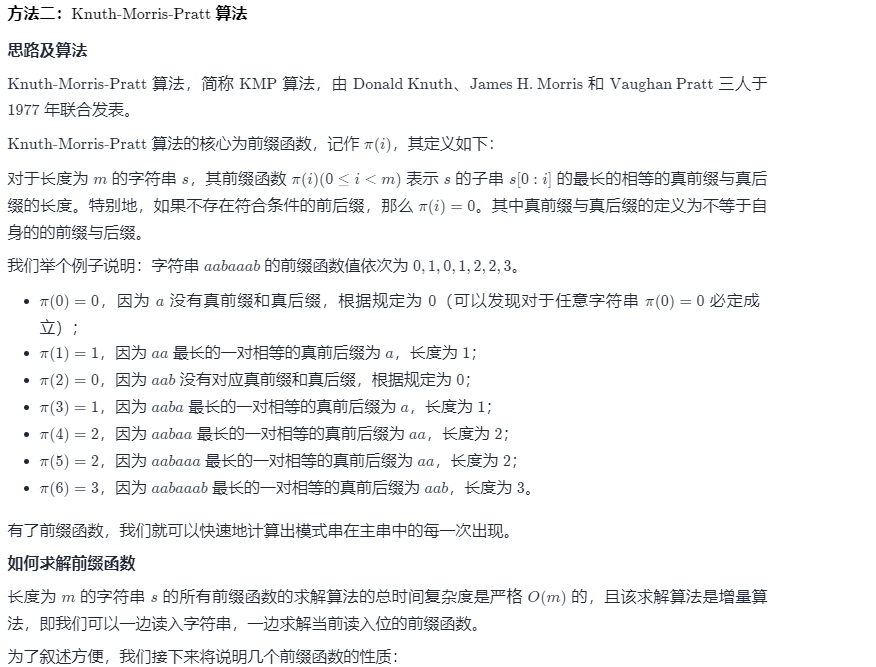
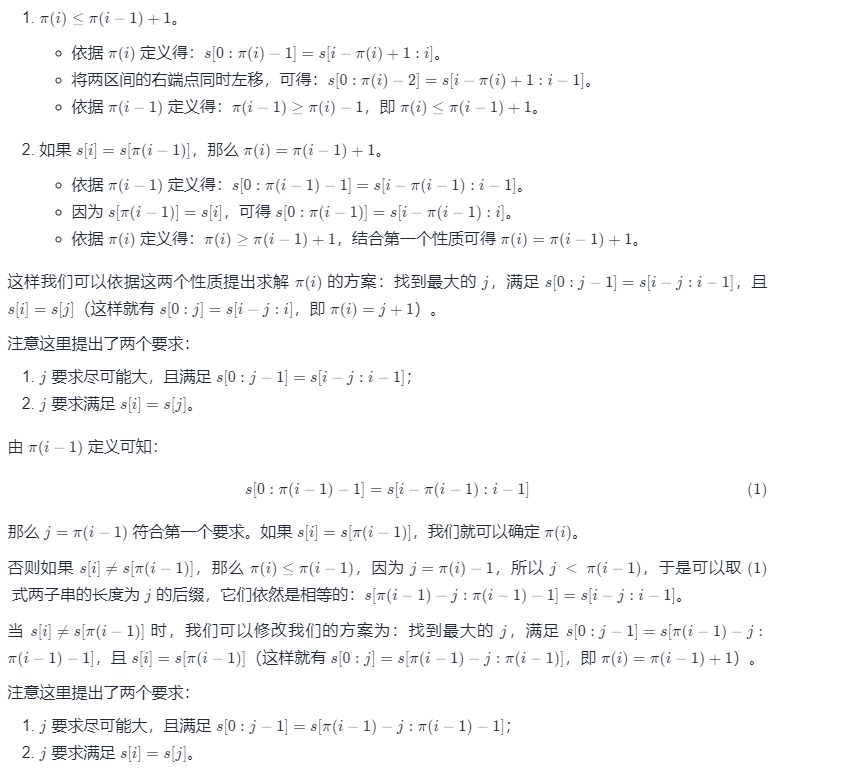
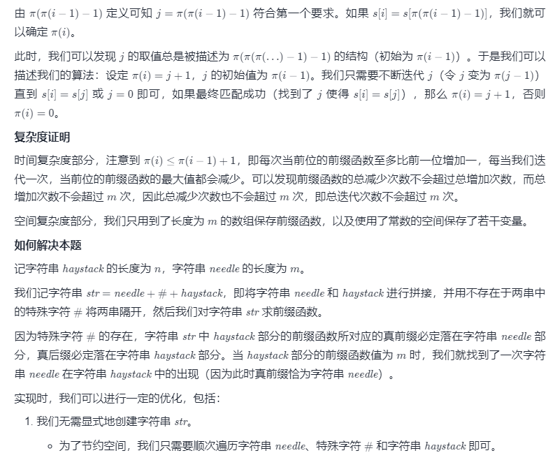
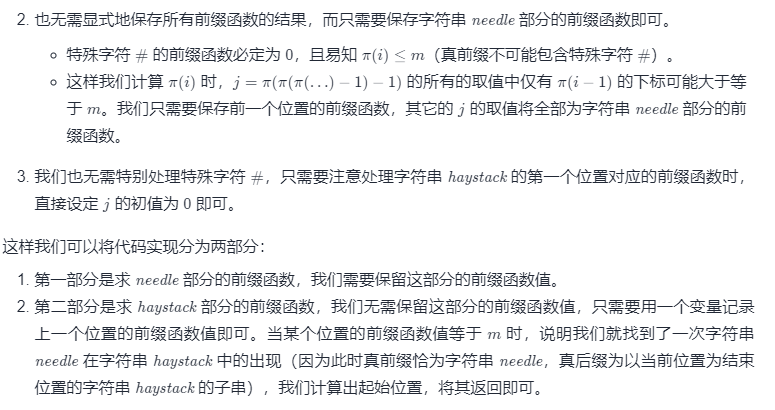

class Solution {
public int strStr(String haystack, String needle) {
int n = haystack.length(), m = needle.length();
if (m == 0) {
return 0;
}
int[] pi = new int[m];
for (int i = 1, j = 0; i < m; i++) {
while (j > 0 && needle.charAt(i) != needle.charAt(j)) {
j = pi[j - 1];
}
if (needle.charAt(i) == needle.charAt(j)) {
j++;
}
pi[i] = j;
}
for (int i = 0, j = 0; i < n; i++) {
while (j > 0 && haystack.charAt(i) != needle.charAt(j)) {
j = pi[j - 1];
}
if (haystack.charAt(i) == needle.charAt(j)) {
j++;
}
if (j == m) {
return i - m + 1;
}
}
return -1;
}
}
复杂度分析

时间复杂度：O(n+m)，其中 n 是字符串 haystack 的长度，m 是字符串 needle 的长度。我们至多需要遍历两字符串一次。

空间复杂度：O(m)，其中 mm 是字符串 needle 的长度。我们只需要保存字符串 needle 的前缀函数。

https://www.ruanyifeng.com/blog/2013/05/Knuth%E2%80%93Morris%E2%80%93Pratt_algorithm.html