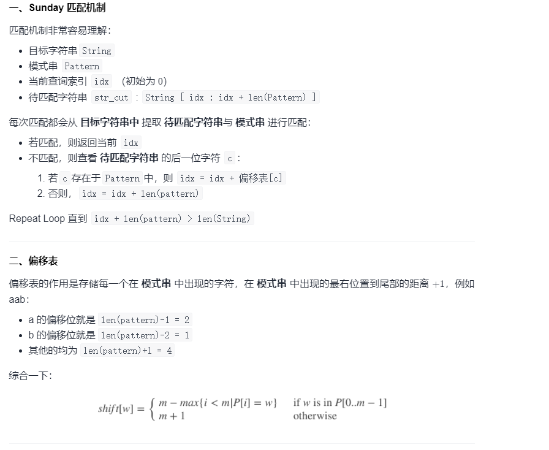
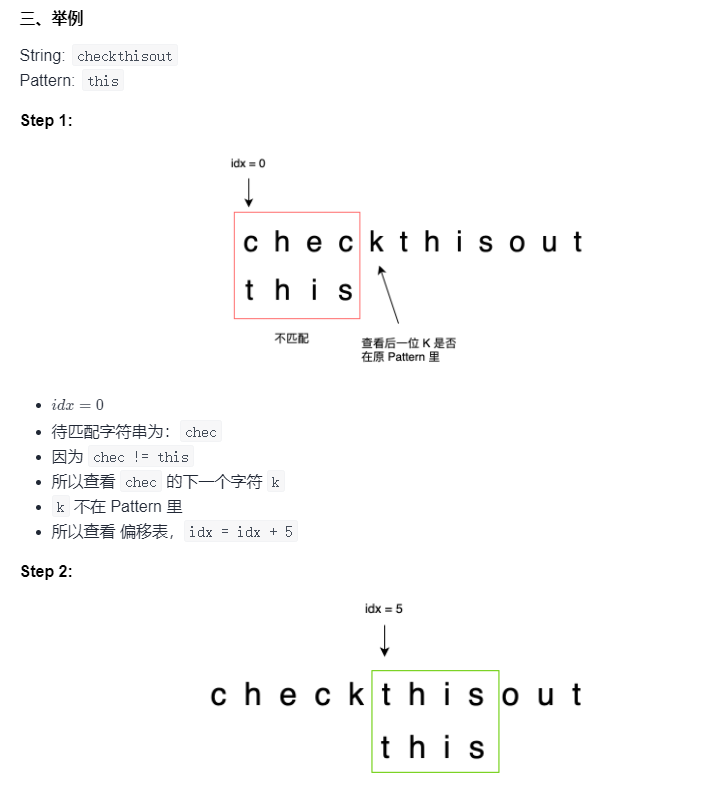

idx=5
待匹配字符串为：this
因为 this == this
匹配，所以返回 5

四、算法分析
最坏情况：O(nm)
平均情况：O(n)

五、代码
Python

class Solution:
def strStr(self, haystack: str, needle: str) -> int:

        # Func: 计算偏移表
        def calShiftMat(st):
            dic = {}
            for i in range(len(st)-1,-1,-1):
                if not dic.get(st[i]):
                    dic[st[i]] = len(st)-i
            dic["ot"] = len(st)+1
            return dic
        
        # 其他情况判断
        if len(needle) > len(haystack):return -1
        if needle=="": return 0
       
        # 偏移表预处理    
        dic = calShiftMat(needle)
        idx = 0
    
        while idx+len(needle) <= len(haystack):
            
            # 待匹配字符串
            str_cut = haystack[idx:idx+len(needle)]
            
            # 判断是否匹配
            if str_cut==needle:
                return idx
            else:
                # 边界处理
                if idx+len(needle) >= len(haystack):
                    return -1
                # 不匹配情况下，根据下一个字符的偏移，移动idx
                cur_c = haystack[idx+len(needle)]
                if dic.get(cur_c):
                    idx += dic[cur_c]
                else:
                    idx += dic["ot"]
            
        
        return -1 if idx+len(needle) >= len(haystack) else idx
