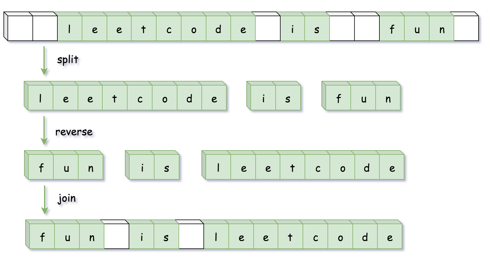

方法一：使用语言特性
思路和算法

很多语言对字符串提供了 split（拆分），reverse（翻转）和 join（连接）等方法，因此我们可以简单的调用内置的 API 完成操作：

使用 split 将字符串按空格分割成字符串数组；
使用 reverse 将字符串数组进行反转；
使用 join 方法将字符串数组拼成一个字符串。

Python3JavaJavaScript

class Solution {
public String reverseWords(String s) {
// 除去开头和末尾的空白字符
s = s.trim();
// 正则匹配连续的空白字符作为分隔符分割
List<String> wordList = Arrays.asList(s.split("\\s+"));
Collections.reverse(wordList);
return String.join(" ", wordList);
}
}
复杂度分析

时间复杂度：O(n)O(n)，其中 nn 为输入字符串的长度。

空间复杂度：O(n)O(n)，用来存储字符串分割之后的结果。
