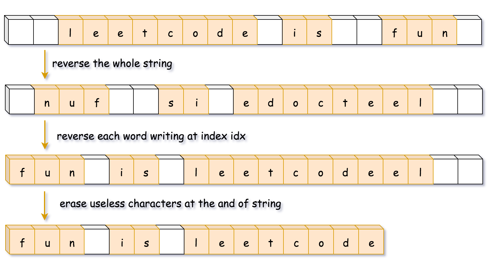

方法二：自行编写对应的函数
思路和算法

我们也可以不使用语言中的 API，而是自己编写对应的函数。在不同语言中，这些函数实现是不一样的，主要的差别是有些语言的字符串不可变（如 Java 和 Python)，有些语言的字符串可变（如 C++)。

对于字符串不可变的语言，首先得把字符串转化成其他可变的数据结构，同时还需要在转化的过程中去除空格。

对于字符串可变的语言，就不需要再额外开辟空间了，直接在字符串上原地实现。在这种情况下，反转字符和去除空格可以一起完成。

复杂度分析

时间复杂度：O(n)，其中 n 为输入字符串的长度。

空间复杂度：Java 和 Python 的方法需要 O(n) 的空间来存储字符串，而 C++ 方法只需要 O(1) 的额外空间来存放若干变量。
