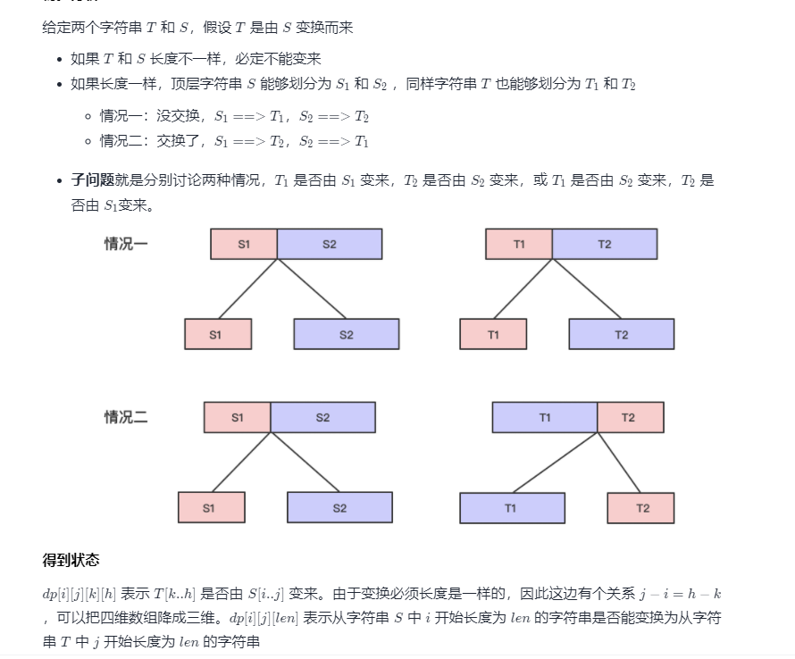
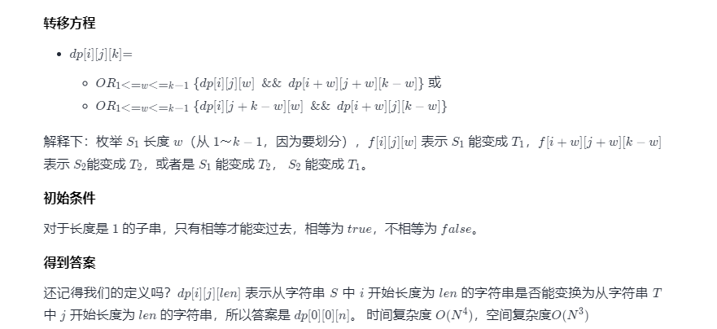

关于区间dp
背景：给定一个序列或字符串要进行一些操作，从最后一步出发，要将序列或字符串去头、去尾，如果做过最长回文子串，你就就可以想一下这样子的操作。区间型 dpdp 一般用
dp[i][j]，i 代表左端点，j 代表右端点，若有其他维度可再添加，若两个端点之间存在联系，则可再压缩空间。

初步分析

代码
Java

class Solution {
public boolean isScramble(String s1, String s2) {
char[] chs1 = s1.toCharArray();
char[] chs2 = s2.toCharArray();
int n = s1.length();
int m = s2.length();
if (n != m) {
return false;
}
boolean[][][] dp = new boolean[n][n][n + 1];
// 初始化单个字符的情况
for (int i = 0; i < n; i++) {
for (int j = 0; j < n; j++) {
dp[i][j][1] = chs1[i] == chs2[j];
}
}

        // 枚举区间长度 2～n
        for (int len = 2; len <= n; len++) {
            // 枚举 S 中的起点位置
            for (int i = 0; i <= n - len; i++) {
                // 枚举 T 中的起点位置
                for (int j = 0; j <= n - len; j++) {
                    // 枚举划分位置
                    for (int k = 1; k <= len - 1; k++) {
                        // 第一种情况：S1 -> T1, S2 -> T2
                        if (dp[i][j][k] && dp[i + k][j + k][len - k]) {
                            dp[i][j][len] = true;
                            break;
                        }
                        // 第二种情况：S1 -> T2, S2 -> T1
                        // S1 起点 i，T2 起点 j + 前面那段长度 len-k ，S2 起点 i + 前面长度k
                        if (dp[i][j + len - k][k] && dp[i + k][j][len - k]) {
                            dp[i][j][len] = true;
                            break;
                        }
                    }
                }
            }
        }
        return dp[0][0][n];
    }
}
当然也可以用递归写

JavaPython

class Solution {
public boolean isScramble(String s1, String s2) {
// 长度不等，必定不能变换
if (s1.length() != s2.length()) {
return false;
}
// 长度相等，先特判下
if (s1.equals(s2)) {
return true;
}
// 看一下字符个数是否一致，不同直接return false
int n = s1.length();
HashMap<Character, Integer> map = new HashMap<>();
for (int i = 0; i < n; i++) {
char c1 = s1.charAt(i);
char c2 = s2.charAt(i);
map.put(c1, map.getOrDefault(c1, 0) + 1);
map.put(c2, map.getOrDefault(c2, 0) - 1);
}
for (Character key : map.keySet()) {
if (map.get(key) != 0) {
return false;
}
}

        // 相同的话，开始判断判断，满足一个就能 return true
        for (int i = 1; i < n; i++) {
            boolean flag =
                    // S1 -> T1，S2 -> T2
                    (isScramble(s1.substring(0, i), s2.substring(0, i)) && isScramble(s1.substring(i), s2.substring(i))) ||
                    // S1 -> T2，S2 -> T1
                    (isScramble(s1.substring(0, i), s2.substring(n - i)) && isScramble(s1.substring(i), s2.substring(0, s2.length() - i)));
            if (flag) {
                return true;
            }
        }
        return false;
    }
}