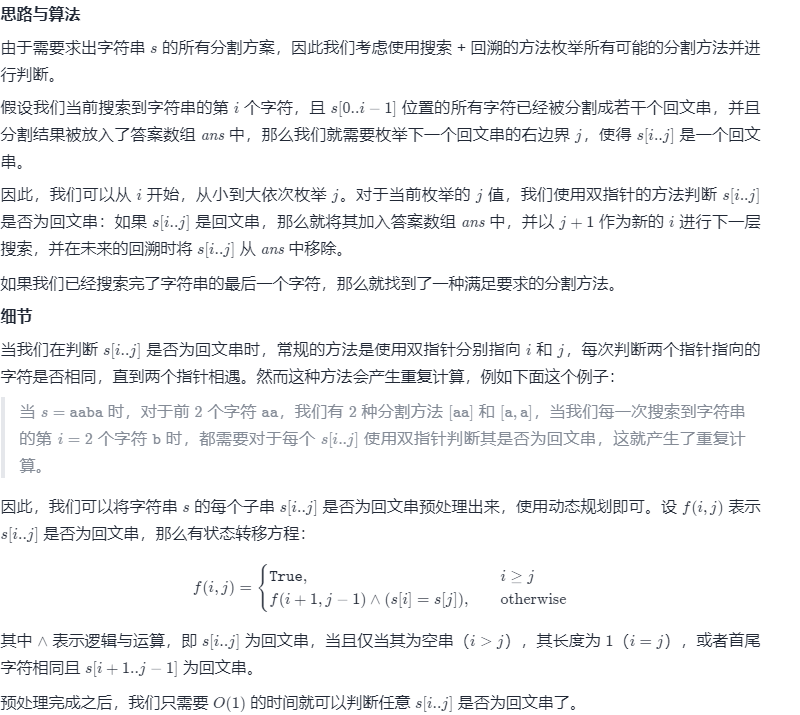

方法一：回溯 + 动态规划预处理
思路与算法

class Solution {
boolean[][] f;
List<List<String>> ret = new ArrayList<List<String>>();
List<String> ans = new ArrayList<String>();
int n;

    public List<List<String>> partition(String s) {
        n = s.length();
        f = new boolean[n][n];
        for (int i = 0; i < n; ++i) {
            Arrays.fill(f[i], true);
        }

        for (int i = n - 1; i >= 0; --i) {
            for (int j = i + 1; j < n; ++j) {
                f[i][j] = (s.charAt(i) == s.charAt(j)) && f[i + 1][j - 1];
            }
        }

        dfs(s, 0);
        return ret;
    }

    public void dfs(String s, int i) {
        if (i == n) {
            ret.add(new ArrayList<String>(ans));
            return;
        }
        for (int j = i; j < n; ++j) {
            if (f[i][j]) {
                ans.add(s.substring(i, j + 1));
                dfs(s, j + 1);
                ans.remove(ans.size() - 1);
            }
        }
    }
}
复杂度分析

时间复杂度：O(n ⋅ 2^n)，其中 nn 是字符串 ss 的长度。在最坏情况下，ss 包含 nn 个完全相同的字符，因此它的任意一种划分方法都满足要求。而长度为 nn 的字符串的划分方案数为 2^{n-1}=O(2^n)，每一种划分方法需要 O(n) 的时间求出对应的划分结果并放入答案，因此总时间复杂度为 O(n ⋅ 2^n)。尽管动态规划预处理需要 O(n^2) 的时间，但在渐进意义下小于 O(n ⋅ 2^n)，因此可以忽略。

空间复杂度：O(n^2)，这里不计算返回答案占用的空间。数组 f 需要使用的空间为 O(n^2)，而在回溯的过程中，我们需要使用 O(n) 的栈空间以及 O(n) 的用来存储当前字符串分割方法的空间。由于 O(n) 在渐进意义下小于 O(n^2)，因此空间复杂度为 O(n^2)。
