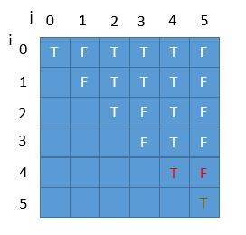

暴力求解，列举所有的子串，判断是否为回文串，保存最长的回文串。

java

public boolean isPalindromic(String s) {
int len = s.length();
for (int i = 0; i < len / 2; i++) {
if (s.charAt(i) != s.charAt(len - i - 1)) {
return false;
}
}
return true;
}

// 暴力解法
public String longestPalindrome(String s) {
String ans = "";
int max = 0;
int len = s.length();
for (int i = 0; i < len; i++)
for (int j = i + 1; j <= len; j++) {
String test = s.substring(i, j);
if (isPalindromic(test) && test.length() > max) {
ans = s.substring(i, j);
max = Math.max(max, ans.length());
}
}
return ans;
}
时间复杂度：两层 for 循环 O(n²），for 循环里边判断是否为回文 O(n），所以时间复杂度为 O(n³）。

public String longestPalindrome(String s) {
int length = s.length();
boolean[][] P = new boolean[length][length];
int maxLen = 0;
String maxPal = "";
for (int len = 1; len <= length; len++) //遍历所有的长度
for (int start = 0; start < length; start++) {
int end = start + len - 1;
if (end >= length) //下标已经越界，结束本次循环
break;
P[start][end] = (len == 1 || len == 2 || P[start + 1][end - 1]) && s.charAt(start) == s.charAt(end); //长度为 1 和 2 的单独判断下
if (P[start][end] && len > maxLen) {
maxPal = s.substring(start, end + 1);
}
}
return maxPal;
}
时间复杂度：两层循环 O(n²）。

空间复杂度：用二维数组 PP 保存每个子串的情况 O(n²)。

我们分析下每次循环用到的 P(i，j），看一看能不能向解法二一样优化一下空间复杂度。

public String longestPalindrome(String s) {
int n = s.length();
String res = "";
boolean[][] dp = new boolean[n][n];
for (int i = n - 1; i >= 0; i--) {
for (int j = i; j < n; j++) {
dp[i][j] = s.charAt(i) == s.charAt(j) && (j - i < 2 || dp[i + 1][j - 1]); //j - i 代表长度减去 1        
if (dp[i][j] &&  j - i + 1 > res.length()) {
res = s.substring(i, j + 1);
}
}
}
return res;
}
时间复杂度和空间复杂和之前都没有变化，我们来看看可不可以优化空间复杂度。

当求第 i 行的时候我们只需要第 i+1 行的信息，并且 j 的话需要 j−1 的信息，所以和之前一样 j 也需要倒叙。

Java

public String longestPalindrome7(String s) {
int n = s.length();
String res = "";
boolean[] P = new boolean[n];
for (int i = n - 1; i >= 0; i--) {
for (int j = n - 1; j >= i; j--) {
P[j] = s.charAt(i) == s.charAt(j) && (j - i < 3 || P[j - 1]);
if (P[j] && j - i + 1 > res.length()) {
res = s.substring(i, j + 1);
}
}
}
return res;
}
时间复杂度：不变 O(n²）。

空间复杂度：降为 O(n) 。

空间复杂度：O(1），常数个变量。